---
## Front matter
title: "Лабораторная работа №1"
subtitle: "Сетевые технологии"
author: "Машков Илья Евгеньевич"

## Generic otions
lang: ru-RU
toc-title: "Содержание"

## Bibliography
bibliography: bib/cite.bib
csl: pandoc/csl/gost-r-7-0-5-2008-numeric.csl

## Pdf output format
toc: true # Table of contents
toc-depth: 2
lof: true # List of figures
lot: true # List of tables
fontsize: 12pt
linestretch: 1.5
papersize: a4
documentclass: scrreprt
## I18n polyglossia
polyglossia-lang:
  name: russian
  options:
	- spelling=modern
	- babelshorthands=true
polyglossia-otherlangs:
  name: english
## I18n babel
babel-lang: russian
babel-otherlangs: english
## Fonts
mainfont: PT Serif
romanfont: PT Serif
sansfont: PT Sans
monofont: PT Mono
mainfontoptions: Ligatures=TeX
romanfontoptions: Ligatures=TeX
sansfontoptions: Ligatures=TeX,Scale=MatchLowercase
monofontoptions: Scale=MatchLowercase,Scale=0.9
## Biblatex
biblatex: true
biblio-style: "gost-numeric"
biblatexoptions:
  - parentracker=true
  - backend=biber
  - hyperref=auto
  - language=auto
  - autolang=other*
  - citestyle=gost-numeric
## Pandoc-crossref LaTeX customization
figureTitle: "Рис."
tableTitle: "Таблица"
listingTitle: "Листинг"
lofTitle: "Список иллюстраций"
lotTitle: "Список таблиц"
lolTitle: "Листинги"
## Misc options
indent: true
header-includes:
  - \usepackage{indentfirst}
  - \usepackage{float} # keep figures where there are in the text
  - \floatplacement{figure}{H} # keep figures where there are in the text
---

# Цель работы

Изучение методов кодирования и модуляции сигналов с помощью высокоуровнего языка программирования Octave. Определение спектра и параметров сигнала. Демонстрация принципов модуляции сигнала на примере аналоговой амплитудной модуляции. Исследование свойства самосинхронизации сигнала.

# Задание

1. Построить графики в Octave
	1. Построить график функции y = sin x + 1/3 * sin 3x + 1/5 * sin 5x  на интервале [-10; 10], используя Octave и в файлы формата eps, .png. 
	2. Добавить график функции y = cos x + 1/3 * cos 3x + 1/5 * cos 5x на интервале [-10; 10]. График экспортировать. 
2. Разложение импульсного сигнала в частичный ряд Фурье:  Разработать код m-файла, результатом выполнения которого являются графики меандра, реализованные с различным количеством гармоник.
3. Определение спектра и параметров сигнала
	1. Определить спектр двух отдельных сигналов и их суммы.
	2. Выполнить задание с другой частотой дискретизации. Пояснить, что будет,
	если взять частоту дискретизации меньше 80 Гц?
4.  Амплитудная модуляция: Продемонстрировать принципы модуляции сигнала на примере аналоговой амплитудной модуляции.

# Выполнение лабораторной работы

##  Построение графиков в Octave

Запускаю Octave с оконным интерфейсом. Перехожу в окно редактора. Создаю новый сценарий. 
В окне редактора повторяю следующий листинг по построению графика функции:

```matlab
% Формирование массива x:
x=-10:0.1:10;
% Формирование массива y.
y1=sin(x)+1/3*sin(3*x)+1/5*sin(5*x);
% Построение графика функции:
plot(x,y1, "-ok; y1=sin(x)+(1/3)*sin(3*x)+(1/5)*sin(5*x);","markersize",4)
% Отображение сетки на графике
grid on;
% Подпись оси X:
xlabel('x');
% Подпись оси Y:
ylabel('y');
% Название графика:
title('y1=sin x+ (1/3)sin(3x)+(1/5)sin(5x)');
% Экспорт рисунка в файл .eps:
print ("plot-sin.eps", "-mono", "-FArial:16", "-deps")
% Экспорт рисунка в файл .png:
print("plot-sin.png");
```

После запуска мы видим созданный график, а в каталоге можем заметить файлы .png и .eps  (рис. [-@fig:001]).

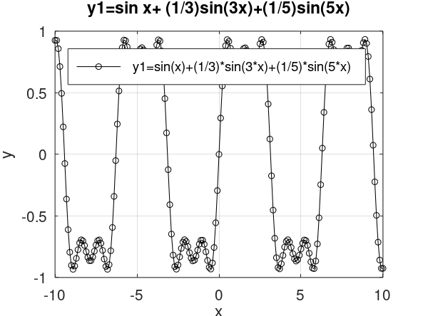{#fig:001 width=70%}

Сохраняю сценарий под другим названием и измените его так, чтобы на одном графике располагались отличающиеся по типу линий графики функций y1 = sin x + 1/3 * sin 3x + 1/5 * sin 5x и y2 = cos x + 1/3 * cos 3x + 1/5 * cos 5x. Соответственным образом модифицирую код:

```
% Формирование массива x:
x=-10:0.1:10;
% Формирование массива y.
y1=sin(x)+1/3*sin(3*x)+1/5*sin(5*x);
y2=cos(x)+1/3*cos(3*x)+1/5*cos(5*x);
% Построение графика функции:
plot(x,y1, "-ok; y1=sin(x)+(1/3)*sin(3*x)+(1/5)*sin(5*x);","markersize",4)
hold on
plot(x,y2, "-; y2=cos(x)+1/3*cos(3*x)+1/5*cos(5*x);","markersize",4)
% Отображение сетки на графике
grid on;
% Подпись оси X:
xlabel('x');
% Подпись оси Y:
ylabel('y');
% Название графика:
% title('y1=sin x+ (1/3)sin(3x)+(1/5)sin(5x)');
% Экспорт рисунка в файл .eps:
print ("plot-sin-cos.eps", "-mono", "-FArial:16", "-deps")
% Экспорт рисунка в файл .png:
print("plot-sin-cos.png");
```

Имеем график (рис. [-@fig:002]).

{#fig:002 width=70%}

## Разложение импульсного сигнала в частичный ряд Фурье

Создаю файл meandr.m. В коде созданного сценария задаю начальные значения:

```
% meandr.m
% количество отсчетов (гармоник):
N=8;
% частота дискретизации:
t=-1:0.01:1;
% значение амплитуды:
A=1;
% период:
T=1;
```

Гармоники, образующие меандр, имеют амплитуду, обратно пропорциональную номеру соответствующей гармоники в спектре:

```
% амплитуда гармоник
nh=(1:N)*2-1;
% массив коэффициентов для ряда, заданного через cos:
Am=2/pi ./ nh;
Am(2:2:end) = -Am(2:2:end);
```

Далее задаём массив значений гармоник массив элементов ряда:
```
% массив гармоник:
harmonics=cos(2 * pi * nh' * t/T);
% массив элементов ряда:
s1=harmonics.*repmat(Am',1,length(t));
```

Далее для построения в одном окне отдельных графиков меандра с различным количеством гармоник реализуем суммирование ряда с накоплением и воспользуемся функциями subplot и plot для построения графиков:
```
% Суммирование ряда:
s2=cumsum(s1);
% Построение графиков:
for k=1:N
subplot(4,2,k)
plot(t, s2(k,:))
end
```

Экспортируем полученный график в файл в формате .png (рис. [-@fig:003]).

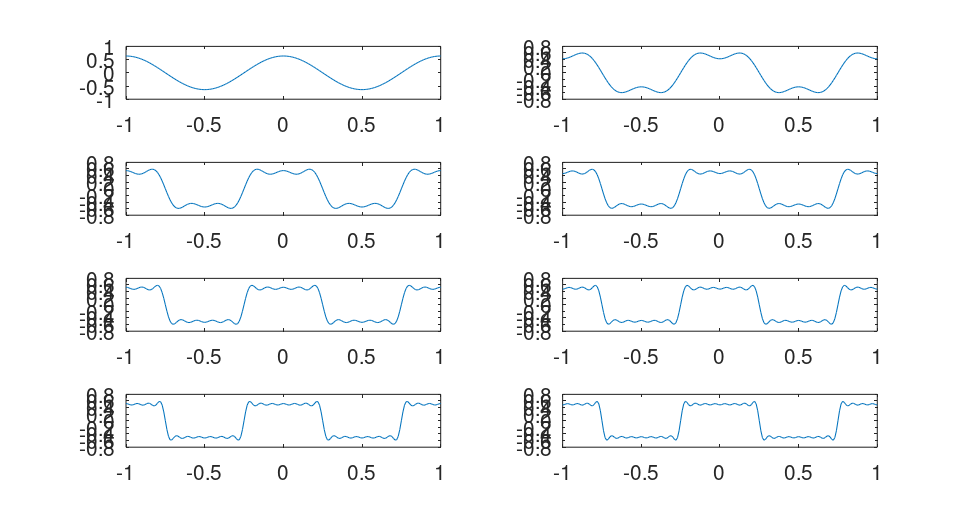{#fig:003 width=70%}

Корректируем код для реализации меандра через синусы:

```
% meandr.m
% количество отсчетов (гармоник):
N=8;
% частота дискретизации:
t=-1:0.01:1;
% значение амплитуды:
A=1;
% период:
T=1;
% амплитуда гармоник
nh=(1:N)*2-1;
% массив коэффициентов для ряда, заданного через sin:
Am=2/pi ./ nh;
% Am(2:2:end) = -Am(2:2:end); -not needed
% массив гармоник:
harmonics=sin(2 * pi * nh' * t/T);
% массив элементов ряда:
s1=harmonics.*repmat(Am',1,length(t));
% Суммирование ряда:
s2=cumsum(s1);
% Построение графиков:
for k=1:N
subplot(4,2,k)
plot(t, s2(k,:))
end

% Экспорт в .png
print("plot-meandr-sin.png")
```

Получаем аналогичный график (рис. [-@fig:004]).

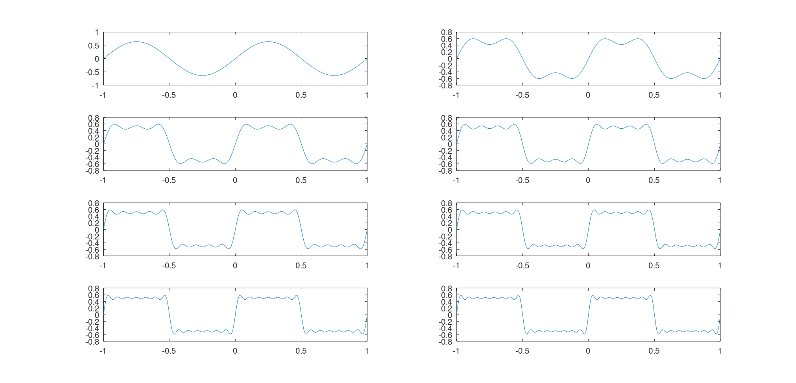{#fig:004 width=70%}

##  Определение спектра и параметров сигнала

В  рабочем каталоге создаю каталог spectre1 и в нём новый сценарий с именем, spectre.m.
В коде созданного сценария задайте начальные значения:
```
% spectre1/spectre.m
% Создание каталогов signal и spectre для размещения графиков:
mkdir 'signal';
mkdir 'spectre';
% Длина сигнала (с):
tmax = 0.5;
% Частота дискретизации (Гц) (количество отсчётов):
fd = 512;
% Частота первого сигнала (Гц):
f1 = 10;
% Частота второго сигнала (Гц):
f2 = 40;
% Амплитуда первого сигнала:
a1 = 1;
% Амплитуда второго сигнала:
a2 = 0.7;
% Массив отсчётов времени:
t = 0:1./fd:tmax;
% Спектр сигнала:
fd2 = fd/2;
```

Далее в коде задаю два синусоидальных сигнала разной частоты:

```
% Два сигнала разной частоты:
signal1 = a1*sin(2*pi*t*f1);
signal2 = a2*sin(2*pi*t*f2);
```

Строю графики сигналов (рис. [-@fig:005]).

```
% График 1-го сигнала:
plot(signal1,'b');
% График 2-го сигнала:
hold on
plot(signal2,'r');
hold off
title('Signal');
% Экспорт графика в файл в каталоге signal:
print 'signal/spectre.png';
```

{#fig:005 width=70%}

С помощью быстрого преобразования Фурье находим спектры сигналов (рис. [-@fig:006]), добавив в файл spectre.m следующий код:

```
% Посчитаем спектр
% Амплитуды преобразования Фурье сигнала 1:
spectre1 = abs(fft(signal1,fd));
% Амплитуды преобразования Фурье сигнала 2:
spectre2 = abs(fft(signal2,fd));
% Построение графиков спектров сигналов:
plot(spectre1,'b');
hold on
plot(spectre2,'r');
hold off
title('Spectre');
print 'spectre/spectre.png';
```

Учитывая реализацию преобразования Фурье, корректирую график спектра (рис. [-@fig:007]): отбросываем дублирующие отрицательные частоты, а также принимаем в расчёт то, что на каждом шаге вычисления быстрого преобразования Фурье происходит суммирование амплитуд сигналов. Для этого добавляю в файл spectre.m следующий код:

```
% Исправление графика спектра
% Сетка частот:
f = 1000*(0:fd2)./(2*fd);
% Нормировка спектров по амплитуде:
spectre1 = 2*spectre1/fd2;
spectre2 = 2*spectre2/fd2;
% Построение графиков спектров сигналов:
plot(f,spectre1(1:fd2+1),'b');
hold on
plot(f,spectre2(1:fd2+1),'r');
hold off
xlim([0 100]);
title('Fixed spectre');
xlabel('Frequency (Hz)');
print 'spectre/spectre_fix.png';
```

{#fig:006 width=70%}

{#fig:007 width=70%}

Найдём спектр суммы рассмотренных сигналов (рис. [-@fig:008]), создав каталог spectr_sum и файл в нём spectre_sum.m со следующим кодом:

```
ctr_sum и файл в нём spectre_sum.m со следующим кодом:
% spectr_sum/spectre_sum.m
% Создание каталогов signal и spectre для размещения графиков:
mkdir 'signal';
mkdir 'spectre';
% Длина сигнала (с):
tmax = 0.5;
% Частота дискретизации (Гц) (количество отсчётов):
fd = 512;
% Частота первого сигнала (Гц):
f1 = 10;
% Частота второго сигнала (Гц):
f2 = 40;
% Амплитуда первого сигнала:
a1 = 1;
% Амплитуда второго сигнала:
a2 = 0.7;
% Спектр сигнала
fd2 = fd/2;
% Сумма двух сигналов (синусоиды) разной частоты:
% Массив отсчётов времени:
t = 0:1./fd:tmax;
signal1 = a1*sin(2*pi*t*f1);
signal2 = a2*sin(2*pi*t*f2);
signal = signal1 + signal2;
plot(signal);
title('Signal');
print 'signal/spectre_sum.png';
% Подсчет спектра:
% Амплитуды преобразования Фурье сигнала:
spectre = fft(signal,fd);
% Сетка частот
f = 1000*(0:fd2)./(2*fd);
% Нормировка спектра по амплитуде:
spectre = 2*sqrt(spectre.*conj(spectre))./fd2;
% Построение графика спектра сигнала:
plot(f,spectre(1:fd2+1))
xlim([0 100]);
title('Spectre');
xlabel('Frequency (Hz)');
print 'spectre/spectre_sum.png';
```

В результате получим аналогичный предыдущему результат (рис. [-@fig:009]), т.е. спектр суммы сигналов равен сумме спектров сигналов, что вытекает из свойств преобразования Фурье.

{#fig:008 width=70%}

{#fig:009 width=70%}

## Амплитудная модуляция

Создаю каталог modulation и в нём новый сценарий с именем am.m. Добавляю в файле am.m следующий код:

```
% modulation/am.m
% Создание каталогов signal и spectre для размещения графиков:
mkdir 'signal';
mkdir 'spectre';
% Модуляция синусоид с частотами 50 и 5
% Длина сигнала (с)
tmax = 0.5;
% Частота дискретизации (Гц) (количество отсчётов)
fd = 512;
% Частота сигнала (Гц)
f1 = 5;
% Частота несущей (Гц)
f2 = 50;
% Спектр сигнала
fd2 = fd/2;
% Построение графиков двух сигналов (синусоиды)
% разной частоты
% Массив отсчётов времени:
t = 0:1./fd:tmax;
signal1 = sin(2*pi*t*f1);
signal2 = sin(2*pi*t*f2);
signal = signal1 .* signal2;
plot(signal, 'b');
hold on
% Построение огибающей:
plot(signal1, 'r');
plot(-signal1, 'r');
hold off
title('Signal');
print 'signal/am.png';
% Расчет спектра:
% Амплитуды преобразования Фурье-сигнала:
spectre = fft(signal,fd);
% Сетка частот:
f = 1000*(0:fd2)./(2*fd);
% Нормировка спектра по амплитуде:
spectre = 2*sqrt(spectre.*conj(spectre))./fd2;
% Построение спектра:
plot(f,spectre(1:fd2+1), 'b')
xlim([0 100]);
title('Spectre');
xlabel('Frequency (Hz)');
print 'spectre/am.png';
```

В результате получаем, что спектр произведения представляет собой свёртку спектров (рис. [-@fig:011]).

{#fig:010 width=70%}

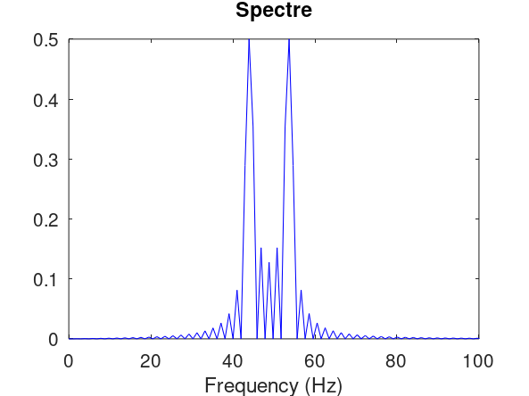{#fig:011 width=70%}

## Кодирование сигнала. Исследование свойства самосинхронизации сигнала

Создаю каталог coding и в нём файлы main.m, maptowave.m, unipolar.m, ami.m, bipolarnrz.m, bipolarrz.m, manchester.m, diffmanc.m, calcspectre.m.

В файле main.m подключаем пакет signal и задаём входные кодовые последовательности:

```
% coding/main.m
% Подключение пакета signal:
pkg load signal;

% Входная кодовая последовательность:
data=[0 1 0 0 1 1 0 0 0 1 1 0];
% Входная кодовая последовательность для проверки свойства самосинхронизации:
data_sync=[0 0 0 0 0 0 0 1 1 1 1 1 1 1];
% Входная кодовая последовательность для построения спектра сигнала:
data_spectre=[0 1 0 1 0 1 0 1 0 1 0 1 0 1];
% Создание каталогов signal, sync и spectre для размещения графиков:
mkdir 'signal';
mkdir 'sync';
mkdir 'spectre';
axis("auto");
```

Затем в этом же файле прописываем вызовы функций для построения графиков модуляций кодированных сигналов для кодовой последовательности data:

```
% Униполярное кодирование
wave=unipolar(data);
plot(wave);
ylim([-1 6]);
title('Unipolar');
print 'signal/unipolar.png';
% Кодирование ami
wave=ami(data);
plot(wave)
title('AMI');
print 'signal/ami.png';
% Кодирование NRZ
wave=bipolarnrz(data);
plot(wave);
title('Bipolar Non-Return to Zero');
print 'signal/bipolarnrz.png';
% Кодирование RZ
wave=bipolarrz(data);
plot(wave)
title('Bipolar Return to Zero');
print 'signal/bipolarrz.png';
% Манчестерское кодирование
wave=manchester(data);
plot(wave)
title('Manchester');
print 'signal/manchester.png';
% Дифференциальное манчестерское кодирование
wave=diffmanc(data);
plot(wave)
title('Differential Manchester');
print 'signal/diffmanc.png';
```

Затем в этом же файле пропишите вызовы функций для построения графиков модуляций кодированных сигналов для кодовой последовательности data_sync:

```
% Униполярное кодирование
wave=unipolar(data_sync);
plot(wave);
ylim([-1 6]);
title('Unipolar');
print 'sync/unipolar.png';
% Кодирование AMI
wave=ami(data_sync);
plot(wave)
title('AMI');
print 'sync/ami.png';
% Кодирование NRZ
wave=bipolarnrz(data_sync);
plot(wave);
title('Bipolar Non-Return to Zero');
print 'sync/bipolarnrz.png';
% Кодирование RZ
wave=bipolarrz(data_sync);
plot(wave)
title('Bipolar Return to Zero');
print 'sync/bipolarrz.png';
% Манчестерское кодирование
wave=manchester(data_sync);
plot(wave)
title('Manchester');
print 'sync/manchester.png';
% Дифференциальное манчестерское кодирование
wave=diffmanc(data_sync);
plot(wave)
title('Differential Manchester');
print 'sync/diffmanc.png';
```

Далее в этом же файле прописываем вызовы функций для построения графиков спектров:

```
% Униполярное кодирование:
wave=unipolar(data_spectre);
spectre=calcspectre(wave);
title('Unipolar');
print 'spectre/unipolar.png';
% Кодирование AMI:
wave=ami(data_spectre);
spectre=calcspectre(wave);
title('AMI');
print 'spectre/ami.png';
% Кодирование NRZ:
wave=bipolarnrz(data_spectre);
spectre=calcspectre(wave);
title('Bipolar Non-Return to Zero');
print 'spectre/bipolarnrz.png';
% Кодирование RZ:
wave=bipolarrz(data_spectre);
spectre=calcspectre(wave);
title('Bipolar Return to Zero');
print 'spectre/bipolarrz.png';
% Манчестерское кодирование:
wave=manchester(data_spectre);
spectre=calcspectre(wave);
title('Manchester');
print 'spectre/manchester.png';
% Дифференциальное манчестерское кодирование:
wave=diffmanc(data_spectre);
spectre=calcspectre(wave);
title('Differential Manchester');
print 'spectre/diffmanc.png';
```

В файле maptowave.m прописываем функцию, которая по входному битовому потоку строит график сигнала:

```
% coding/maptowave.m
function wave=maptowave(data)
	data=upsample(data,100);
	wave=filter(5*ones(1,100),1,data);
```

В файлах unipolar.m, ami.m, bipolarnrz.m, bipolarrz.m, manchester.m, diffmanc.m прописываем соответствующие функции преобразования кодовой последовательности data с вызовом функции maptowave для построения соответствующего графика.


Униполярное кодирование:
```
% coding/unipolar.m
% Униполярное кодирование:
function wave=unipolar(data)
wave=maptowave(data);
```

Кодирование AMI:
```
одирование AMI:
% coding/ami.m
% Кодирование AMI:
function wave=ami(data)
am=mod(1:length(data(data==1)),2);
am(am==0)=-1;
data(data==1)=am;
wave=maptowave(data);
```

Кодирование NRZ:
```
% coding/bipolarnrz.m
% Кодирование NRZ:
function wave=bipolarnrz(data)
data(data==0)=-1;
wave=maptowave(data);
```

Кодирование RZ:
```
% coding/bipolarrz.m
% Кодирование RZ:
function wave=bipolarrz(data)
data(data==0)=-1;
data=upsample(data,2);
wave=maptowave(data);
```

Манчестерское кодирование:
```
% coding/manchester.m
% Манчестерское кодирование:
function wave=manchester(data)
data(data==0)=-1;
data=upsample(data,2);
data=filter([-1 1],1,data);
wave=maptowave(data);
```

Дифференциальное манчестерское кодирование:
```
% coding/diffmanc.m
% Дифференциальное манчестерское кодирование
function wave=diffmanc(data)
data=filter(1,[1 1],data);
data=mod(data,2);
wave=manchester(data);
```

В файле calcspectre.m прописываем функцию построения спектра сигнала:

```
% calcspectre.m
% Функция построения спектра сигнала:
function spectre = calcspectre(wave)
% Частота дискретизации (Гц):
Fd = 512;
Fd2 = Fd/2;
Fd3 = Fd/2 + 1;
X = fft(wave,Fd);
spectre = X.*conj(X)/Fd;
f = 1000*(0:Fd2)/Fd;
plot(f,spectre(1:Fd3));
xlabel('Frequency (Hz)');
```

Запускаю главный скрипт main.m. В каталоге signal должны быть получены файлы с графиками кодированного сигнала (рис. [-@fig:012] – рис. [-@fig:017]), в каталоге sync — файлы с графиками, иллюстрирующими свойства самосинхронизации (рис. [-@fig:018] – рис. [-@fig:023]), в каталоге spectre — файлы с графиками спектров сигналов (рис. [-@fig:024] – рис. [-@fig:029]).

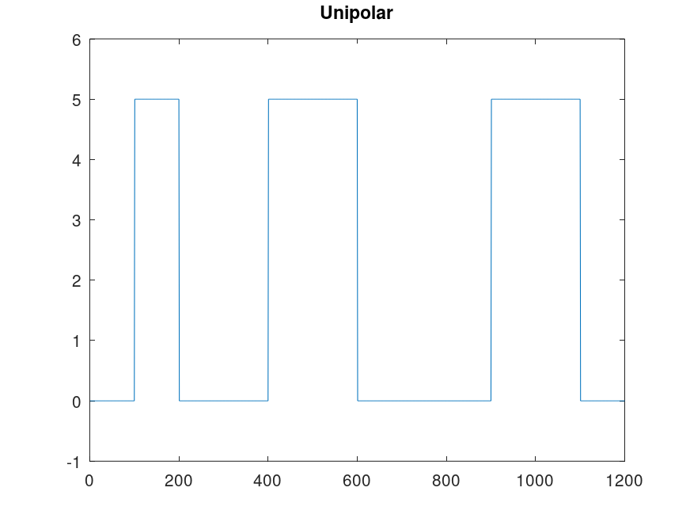{#fig:017}

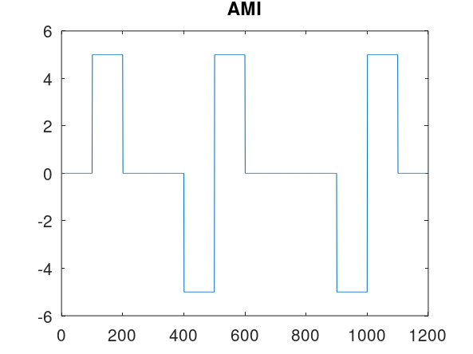{#fig:012}

{#fig:013}

{#fig:014}

{#fig:016}

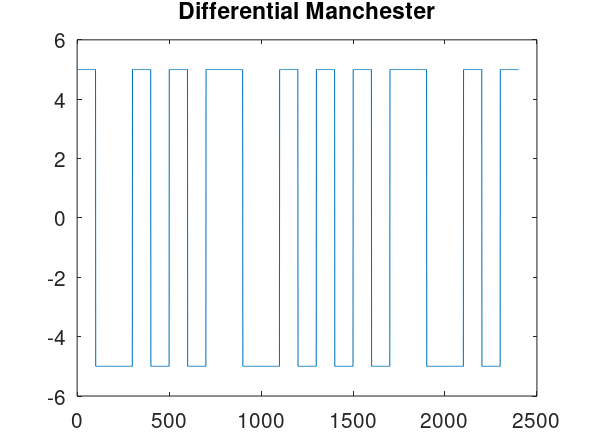{#fig:015}

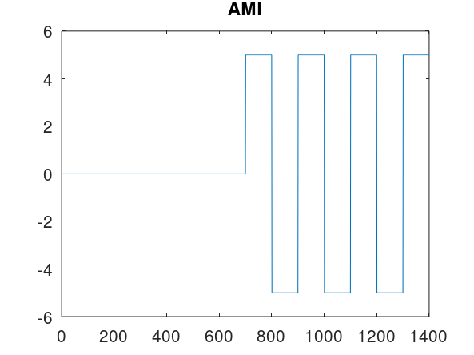{#fig:018}

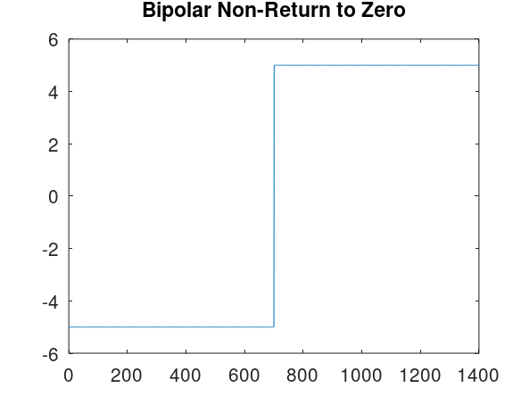{#fig:019}

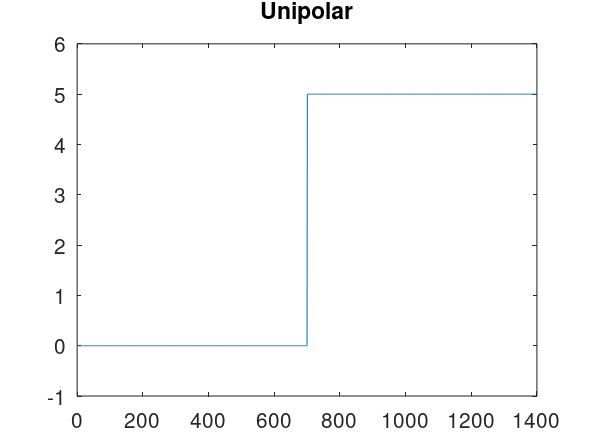{#fig:023}

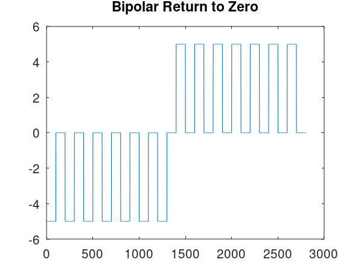{#fig:020}

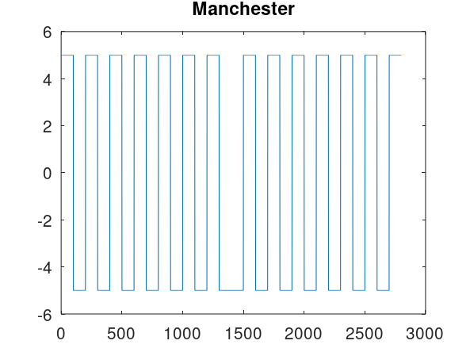{#fig:022}

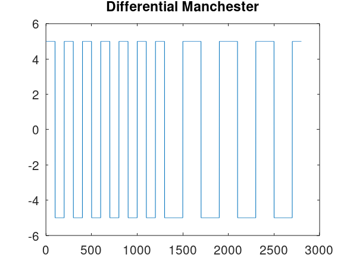{#fig:021 width=70%}

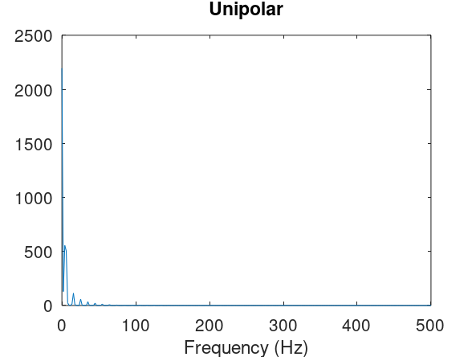{#fig:029}

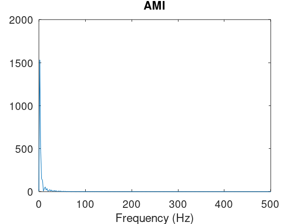{#fig:024}

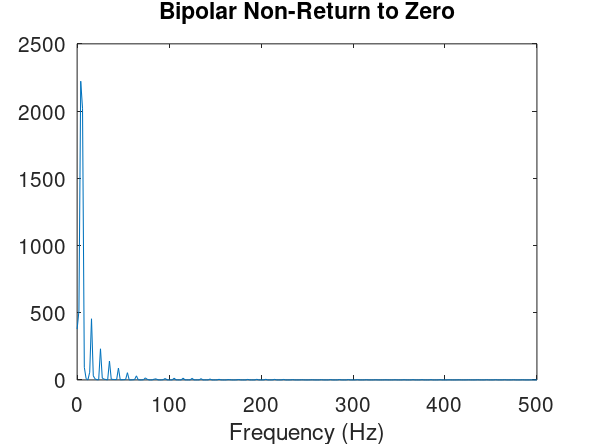{#fig:025}

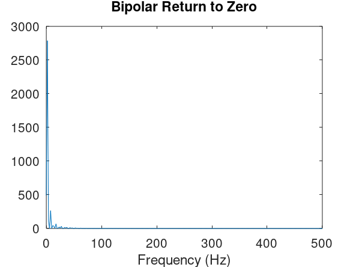{#fig:026}

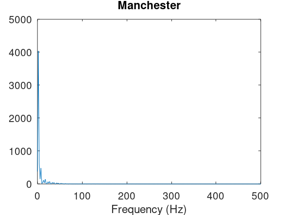{#fig:028}

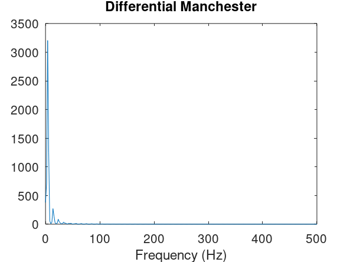{#fig:027}


# Выводы

В ходе данной лабораторной работы я изучил методы кодирования и модуляции сигналов с помощью высокоуровнего языка программирования Octave. Научился определять спектра и параметров сигнала. Были продемонстрированы принципы модуляции сигнала на примере аналоговой амплитудной модуляции. Так же были исследованы свойства самосинхронизации сигнала.

# Список литературы{.unnumbered}

[Сетевые технологии](https://esystem.rudn.ru/pluginfile.php/2858159/mod_resource/content/3/001-lab_cod-mod-2.pdf)
