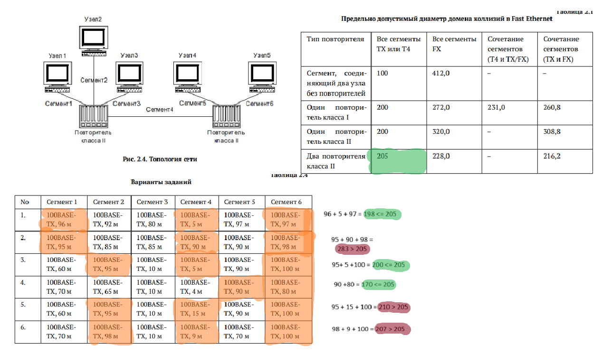

---
## Front matter
title: "Лабораторная работа №2"
subtitle: "Сетевые технологии"
author: "Машков Илья Евгеньевич"

## Generic otions
lang: ru-RU
toc-title: "Содержание"

## Bibliography
bibliography: bib/cite.bib
csl: pandoc/csl/gost-r-7-0-5-2008-numeric.csl

## Pdf output format
toc: true # Table of contents
toc-depth: 2
lof: true # List of figures
lot: true # List of tables
fontsize: 12pt
linestretch: 1.5
papersize: a4
documentclass: scrreprt
## I18n polyglossia
polyglossia-lang:
  name: russian
  options:
	- spelling=modern
	- babelshorthands=true
polyglossia-otherlangs:
  name: english
## I18n babel
babel-lang: russian
babel-otherlangs: english
## Fonts
mainfont: PT Serif
romanfont: PT Serif
sansfont: PT Sans
monofont: PT Mono
mainfontoptions: Ligatures=TeX
romanfontoptions: Ligatures=TeX
sansfontoptions: Ligatures=TeX,Scale=MatchLowercase
monofontoptions: Scale=MatchLowercase,Scale=0.9
## Biblatex
biblatex: true
biblio-style: "gost-numeric"
biblatexoptions:
  - parentracker=true
  - backend=biber
  - hyperref=auto
  - language=auto
  - autolang=other*
  - citestyle=gost-numeric
## Pandoc-crossref LaTeX customization
figureTitle: "Рис."
tableTitle: "Таблица"
listingTitle: "Листинг"
lofTitle: "Список иллюстраций"
lotTitle: "Список таблиц"
lolTitle: "Листинги"
## Misc options
indent: true
header-includes:
  - \usepackage{indentfirst}
  - \usepackage{float} # keep figures where there are in the text
  - \floatplacement{figure}{H} # keep figures where there are in the text
---

# Цель работы

Цель данной работы — изучение принципов технологий Ethernet и Fast Ethernet и практическое освоение методик оценки работоспособности сети, построенной на базе технологии Fast Ethernet.

# Задание

Требуется оценить работоспособность 100-мегабитной сети Fast Ethernet в соответствии с первой и второй моделями.

# Выполнение лабораторной работы

## Оценка работоспособности первой модели

Сеть состоит из терминалов с интерфейсами TX и двух повторителей класса II, следовательно предельно допустимый диаметр домена коллизий равен 205 м.

Конфигурации сети и топология сети представлены на (рис. [-@fig:001]). В таблице оранжевым обозначаю те сегменты, которые в сумме будут давать наибольшее значение с учётом повторителей. Потом эту сумму сравниваю с предельно допустимым диаметром домена коллизий (рис. [-@fig:001]).

{#fig:001 width=70%}

## Оценка работоспособности первой модели

Затем необходимо оценить работоспособность сети в соответствии со второй моделью. Создаю таблицу в Эксель, куда вношу все конфигурации сети, а также дублирую таблицу метрик и выделяю сегменты, которые в сумме дают наихудший путь между двумя узлами домена коллизий (рис. [-@fig:002]). Затем составляю таблицу с выделенными элементами помноженными на коэффициент 1,112 (удельное время двойного оборота для нашей витой пары), потом формирую столбец с макс. временем двойного оборота, значения которого являются суммами значений по строке + времени для повторителей и пары терминалов. Формирую столбец с макс. временем двойного оборота с учётом непредвиденных задержек, прибавляя 4 битовых интервала к значениям из предыдущего столбца. Если макс. время двойного оборота с учётом непредвиденных задержек меньше или равна 512, то получаем истину (рис. [-@fig:002]).

{#fig:002 width=70%}

# Выводы

В ходе данной лабораторной работы я изучил принципы технологий Ethernet и Fast Ethernet и практически освоил методики оценки работоспособности сети, построенной на базе технологии Fast Ethernet.

# Список литературы{.unnumbered}

[Сетевые технологии](https://esystem.rudn.ru/pluginfile.php/2858169/mod_resource/content/3/002-lab_ethernet.pdf)
