---
## Front matter
title: "Лабораторная работа №3"
subtitle: "Сетевые технологии"
author: "Машков Илья Евгеньевич"

## Generic otions
lang: ru-RU
toc-title: "Содержание"

## Bibliography
bibliography: bib/cite.bib
csl: pandoc/csl/gost-r-7-0-5-2008-numeric.csl

## Pdf output format
toc: true # Table of contents
toc-depth: 2
lof: true # List of figures
lot: true # List of tables
fontsize: 12pt
linestretch: 1.5
papersize: a4
documentclass: scrreprt
## I18n polyglossia
polyglossia-lang:
  name: russian
  options:
	- spelling=modern
	- babelshorthands=true
polyglossia-otherlangs:
  name: english
## I18n babel
babel-lang: russian
babel-otherlangs: english
## Fonts
mainfont: PT Serif
romanfont: PT Serif
sansfont: PT Sans
monofont: PT Mono
mainfontoptions: Ligatures=TeX
romanfontoptions: Ligatures=TeX
sansfontoptions: Ligatures=TeX,Scale=MatchLowercase
monofontoptions: Scale=MatchLowercase,Scale=0.9
## Biblatex
biblatex: true
biblio-style: "gost-numeric"
biblatexoptions:
  - parentracker=true
  - backend=biber
  - hyperref=auto
  - language=auto
  - autolang=other*
  - citestyle=gost-numeric
## Pandoc-crossref LaTeX customization
figureTitle: "Рис."
tableTitle: "Таблица"
listingTitle: "Листинг"
lofTitle: "Список иллюстраций"
lotTitle: "Список таблиц"
lolTitle: "Листинги"
## Misc options
indent: true
header-includes:
  - \usepackage{indentfirst}
  - \usepackage{float} # keep figures where there are in the text
  - \floatplacement{figure}{H} # keep figures where there are in the text
---

# Задание

1. Изучение возможностей команды ipconfig для ОС типа Windows (ifconfig для систем типа Linux).
2. Определение MAC-адреса устройства и его типа.
3. Установить на домашнем устройстве Wireshark.
4. С помощью Wireshark захватить и проанализировать пакеты ARP и ICMP в части кадров канального уровня.
5. С помощью Wireshark захватить и проанализировать пакеты HTTP, DNS в части заголовков и информации протоколов TCP, UDP, QUIC.
6. С помощью Wireshark проанализировать handshake протокола TCP.

# Цель работы

Цель данной работы — изучение посредством Wireshark кадров Ethernet, анализ PDU протоколов транспортного и прикладного уровней стека TCP/IP.

# Выполнение лабораторной работы

## MAC-адресация

С помощью команды ipconfig выводим информацию о текущем сетевом соединении (рис. [-@fig:001]).

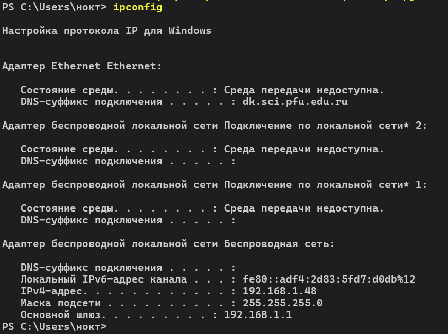{#fig:001 width=70%}

Тут мы видим все сетевые адаптеры, ipv4 и ipv6 адреса и маски подсетей. Адаптер беспроводной локальной сети является основным.

Дальше применим опцию /all (рис. [-@fig:002]), (рис. [-@fig:003]) и (рис. [-@fig:004]).

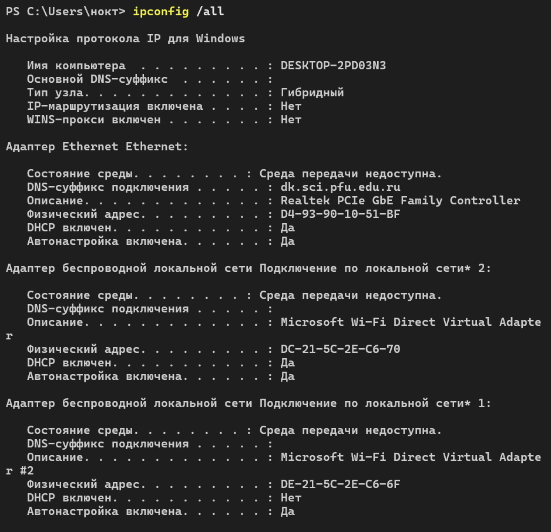{#fig:002 width=70%}

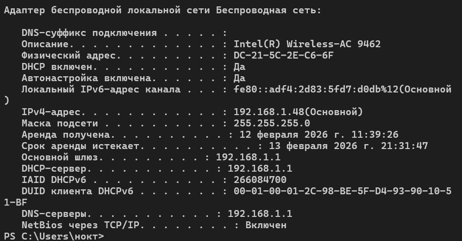{#fig:003 width=70%}

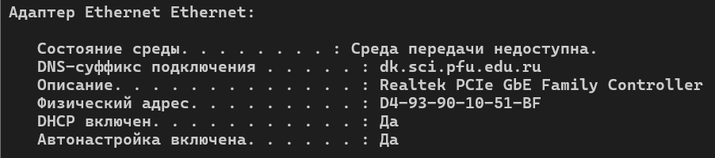{#fig:004 width=70%}

Здесь можно заметить более подробную информацию: имя ПК, мак-адреса адаптеров, наличие dhcp и dns серверов. Определим MAC-адреса на примере двух адаптеров: основного (рис. [-@fig:003]) и ethernet (рис. [-@fig:004]).

Итак, начнем с адреса основного адаптера беспроводной сети **"DC-21-5C-2E-C6-6F"**. Т.к. адаптер у нас интеловский, то первые 3 байта (DC-21-5C) - это и есть индентификатор производителя. Последующие три байта - уникальный номер. Рассмотрим первый байт DC в двоичной системе счисления выглядит следующим образом: 11011100. Первый бит 0, что означает, что это индивидуальный адрес. Второй бит тоже 0, что означает, что адрес у нас глобально администрируемый.

MAC-адрес адаптера eternet выглядит так: **"D4-93-90-10-51-BF"**. Первые три байта определяют, что адаптер стоит от Realtek. Рассмотрим первый бит D4 в двоичной СС 11010100. Тут мы видим абсолютно такую же ситуацию, что и в прошлом случае. Что первый, что второй бит равны нулю, что означает то, что у нас индивидуальный и глобально администрируемый адрес. 

## Анализ кадров канального уровня в Wireshark

После установки и запуска WireShark мы наблюдаем стартовый экран, где мы выбираем нашу беспроводную сеть (рис. [-@fig:005]).

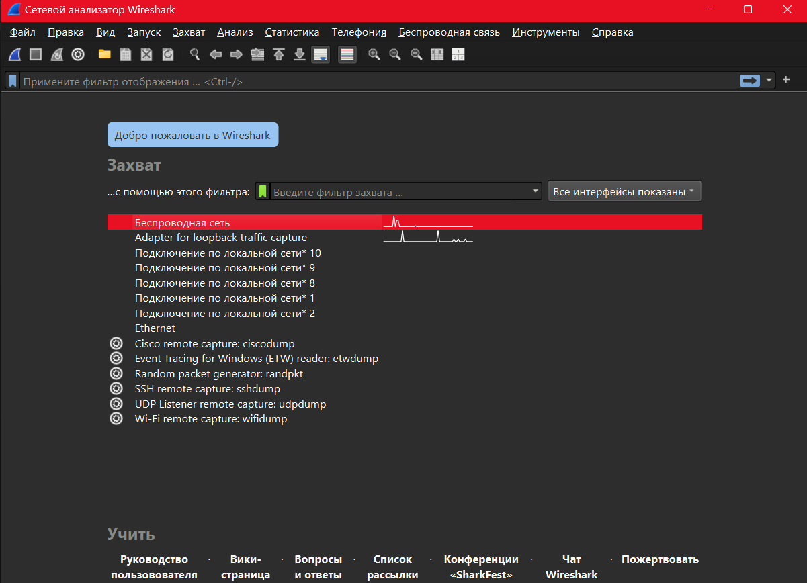{#fig:005 width=70%}

Пропингуем наш шлюз с адресом 192.168.1.1 (рис. [-@fig:008]).

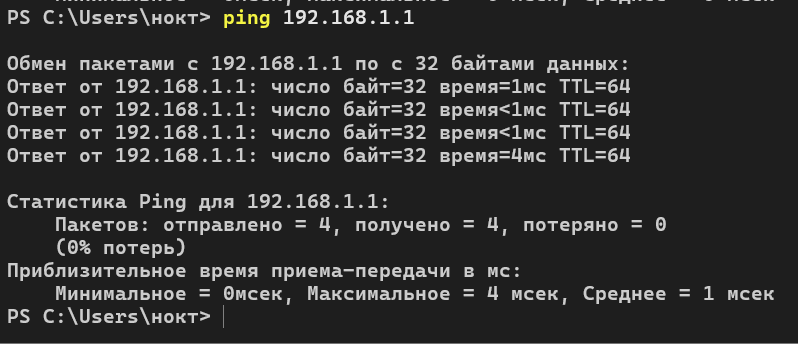{#fig:008 width=70%}

Видим, что появились кадры ICMP(request) (рис. [-@fig:006]).

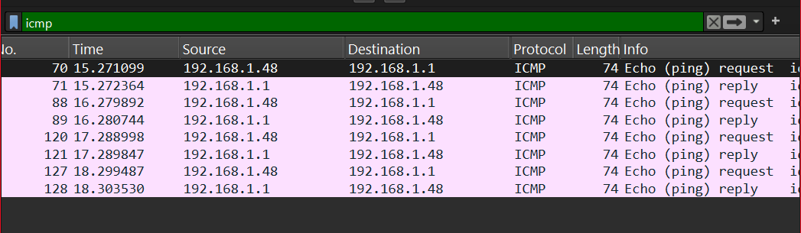{#fig:006 width=70%}

Здесь мы можем заметить общую информацию: время доставки, адрес отправителя и адресата, размер кадра, номер кадра и пр. (рис. [-@fig:007]).

{#fig:007 width=70%}

На данном скриншоте мы видим MAC-адреса отправителя и адресата. Т.к. это детали именно запроса, поэтому отпрвитель это мы, а получатель - это роутер. Как мы можем заметить, оба адреса индивидуальные и глобально администрируемы, что соответствует базовым значениям (рис. [-@fig:009]).

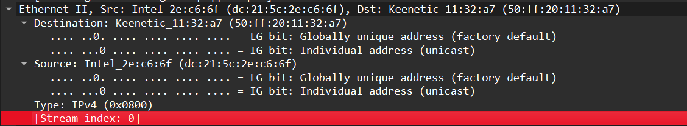{#fig:009 width=70%}

Здесь мы можем увидеть всё то же самое, что и в случае запроса, но отправитель и адресат из запроса просто меняются местами (рис. [-@fig:010]).

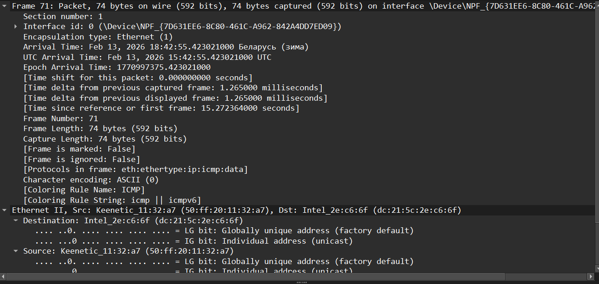{#fig:010 width=70%}

Затем мы просматриваем ARP-пакеты. Тут мы видим, что шлюз моего роутера Keenetic обращается к широковещательному адресу с вопросом о владельце адреса 192.168.1.1, после чего получает ответ от нашего компьютера (рис. [-@fig:011]).

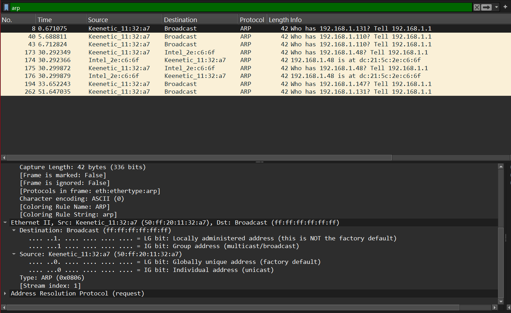{#fig:011 width=70%}

Пропингуем google.com. Тип всех адресов, которые я получил был индивидуальным и глобально администрируемым, а менялись только адреса и порты (рис. [-@fig:012]), (рис. [-@fig:013]), (рис. [-@fig:014])

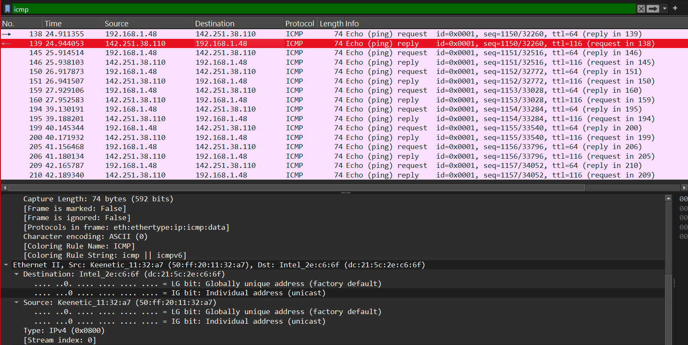{#fig:012 width=70%}

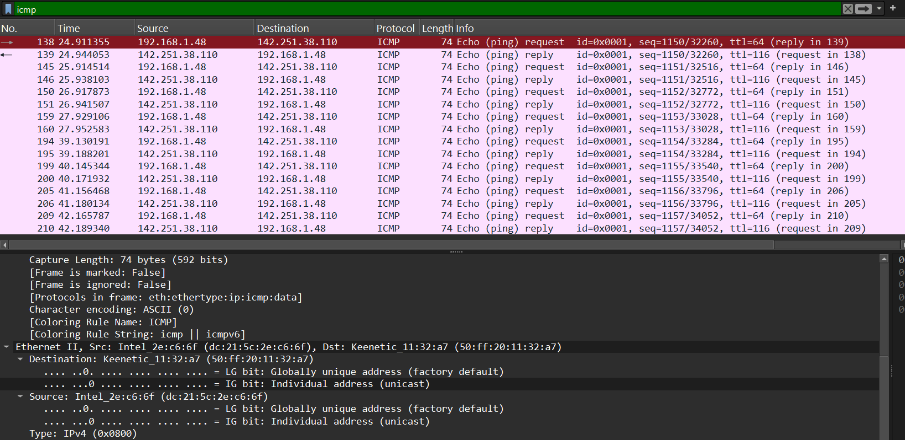{#fig:013 width=70%}

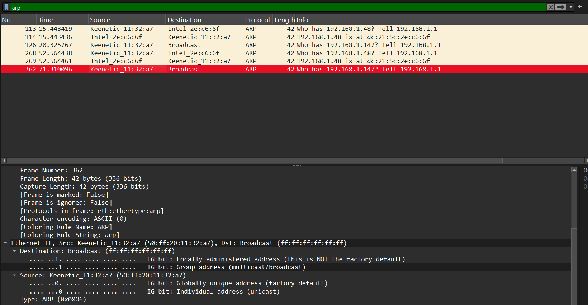{#fig:014 width=70%}

## Анализ протоколов транспортного уровня в Wireshark

На сайте info.cern.ch совершаем действия так, чтобы это отобразилось в Wireshark. Важно: делать это надо непосредственно на этом сайте в секции с ответами на вопросы или ссылками на статьи, которые находятся на этом сайте, потому что там есть ссылки на другие сайты, при взаимодействии с которыми в Wireshark мы ничего не увидим. (рис. [-@fig:016]).

{#fig:016 width=70%}

Здесь мы можем заметить, что адрес сервера 188.185.48.40, а его порт - 59476. Порт источника - 80 (рис. [-@fig:015]). Также мы тут видим флаги FIN, PSH и ACK, что свидетельствует об удачном завершении TCP-соединения с передачей последних данных.

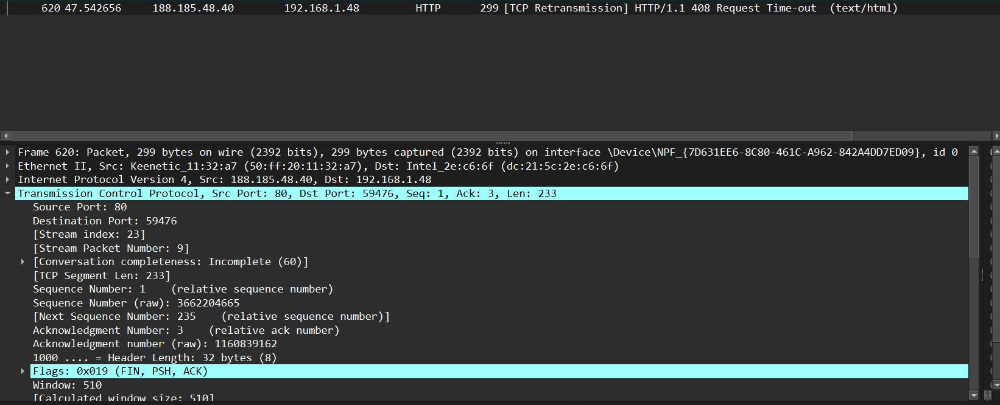{#fig:015 width=70%}

Далее займёмся анализом DNS-трафика. Видим dns-запросы от нашего компьютера 192.168.1.48 к DNS-серверу 192.168.1.1 и ответы. Получили мы, кстати, стандартную A-запись (рис. [-@fig:017]).

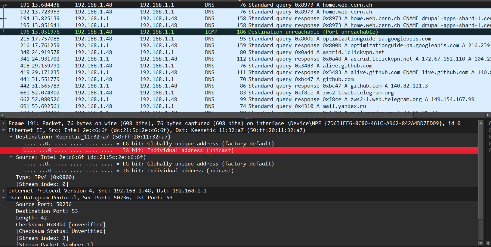{#fig:017 width=70%}

Перейдем к немного более детальному анализу запроса к home.web.cern.ch (рис. [-@fig:018]). Заметим, что используется UDP-протокол, порт источника и порт назначения. В кадре содержаться записи CNAME и A.

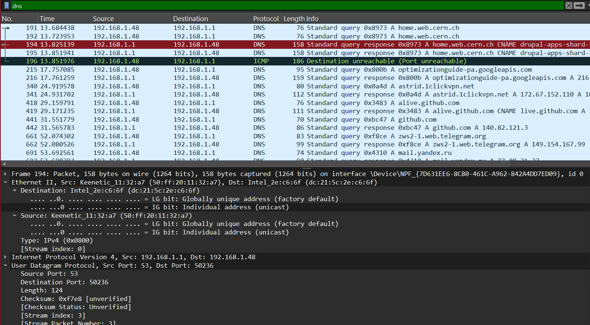{#fig:018 width=70%}

На этих скриншотах (рис. [-@fig:019]) и (рис. [-@fig:020]) ищображены детали пакетов QUIC предназначеных для 443 и 61379 портов.

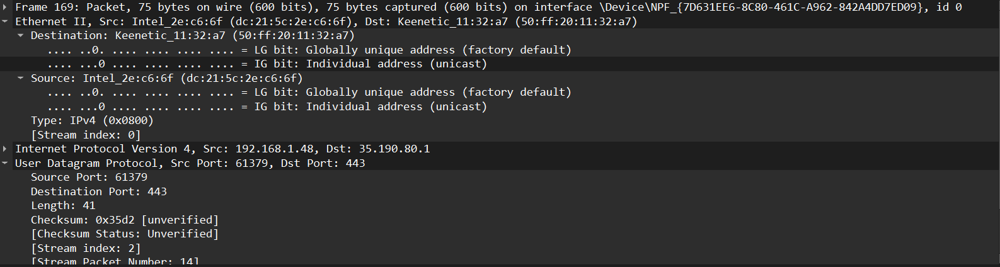{#fig:019 width=70%}

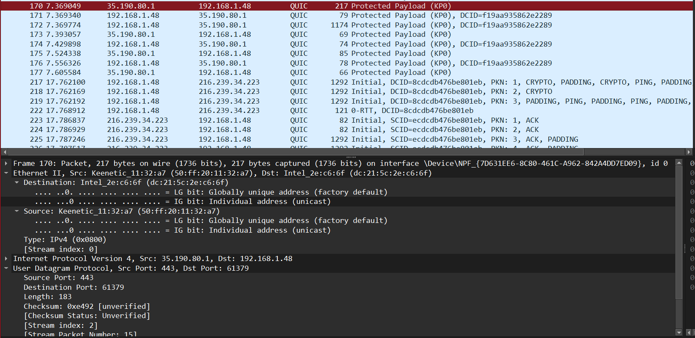{#fig:020 width=70%}

## Анализ handshake протокола TCP в Wireshark

Проанализируем трёхступенчатое рукопожатие TCP (рис. [-@fig:021]). Здесь мы видим отсутствие таких начальных пакетов, как SYN и SYN-ACK, но видим пакеты с флагами ACK, RST и FIN. Также видим ретрансмисии.

{#fig:021 width=70%}

Однако даже при отсутствии некоторых пакетов, мы можем построить график потока, на котором мы видим обмены пакетами с подтверждениями (ACK), а также задержки и повторные передачи (рис. [-@fig:022]).

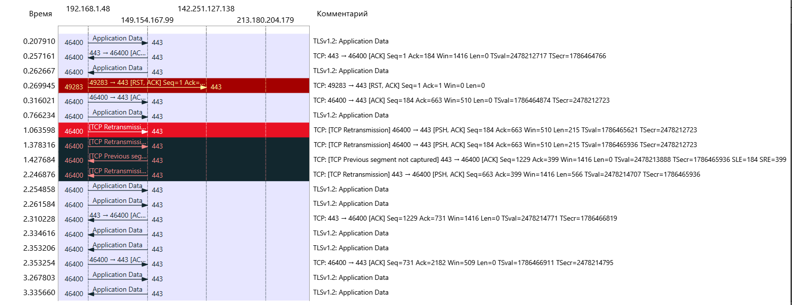{#fig:022 width=70%}

# Выводы

В ходе данной лабораторной работы мной были изучены посредством Wireshark кадры Ethernet, получены практические навыки по анализу PDU протоколов транспортного и прикладного уровней стека TCP/IP.

# Список литературы{.unnumbered}

[Сетевые технологии](https://esystem.rudn.ru/pluginfile.php/2858172/mod_resource/content/3/003-lab_datalink-layer-WSh.pdf)
