---
## Front matter
title: "Лабораторная работа №4"
subtitle: "Сетевые технологии"
author: "Машков Илья Евгеньевич"

## Generic otions
lang: ru-RU
toc-title: "Содержание"

## Bibliography
bibliography: bib/cite.bib
csl: pandoc/csl/gost-r-7-0-5-2008-numeric.csl

## Pdf output format
toc: true # Table of contents
toc-depth: 2
lof: true # List of figures
lot: true # List of tables
fontsize: 12pt
linestretch: 1.5
papersize: a4
documentclass: scrreprt
## I18n polyglossia
polyglossia-lang:
  name: russian
  options:
	- spelling=modern
	- babelshorthands=true
polyglossia-otherlangs:
  name: english
## I18n babel
babel-lang: russian
babel-otherlangs: english
## Fonts
mainfont: PT Serif
romanfont: PT Serif
sansfont: PT Sans
monofont: PT Mono
mainfontoptions: Ligatures=TeX
romanfontoptions: Ligatures=TeX
sansfontoptions: Ligatures=TeX,Scale=MatchLowercase
monofontoptions: Scale=MatchLowercase,Scale=0.9
## Biblatex
biblatex: true
biblio-style: "gost-numeric"
biblatexoptions:
  - parentracker=true
  - backend=biber
  - hyperref=auto
  - language=auto
  - autolang=other*
  - citestyle=gost-numeric
## Pandoc-crossref LaTeX customization
figureTitle: "Рис."
tableTitle: "Таблица"
listingTitle: "Листинг"
lofTitle: "Список иллюстраций"
lotTitle: "Список таблиц"
lolTitle: "Листинги"
## Misc options
indent: true
header-includes:
  - \usepackage{indentfirst}
  - \usepackage{float} # keep figures where there are in the text
  - \floatplacement{figure}{H} # keep figures where there are in the text
---

# Цель работы

Цель данной работы — установка и настройка GNS3 и сопутствующего программного обеспечения.

# Задание

1. Установить GNS3-all-in-one, GNS3 VM, проверить корректность запуска.
2. Импортировать в GNS3 образ маршрутизатора FRR.
3. Импортировать в GNS3 образ маршрутизатора VyOS.

# Выполнение лабораторной работы

## Установка GNS3

Начнём с установки gns3. В первый раз я устанавливал эту утилиту через choco, но это было ошибкой, потому что скачивается та версия, с которой не получится работать так, как предполагается. Поэтому я перешёл на гихаб и скачал версию 2.45....., с которой уже и делал все остальные действия (рис. [-@fig:001]).

{#fig:001 width=70%}

Во время установки в диалоговом окне выбираем загрузку GNS3-DesKtop, GNS3-VM, Tools. Затем выбираем тип виртуальной машины (VBox), а дальше просто ждём. 

## Установка GNS3 VM для VirtualBox

После установки GNS3 и скачивания образа конфигурации виртуальной машины, в самом VirtualBox выбираю импорт конфигурации (рис. [-@fig:002]).

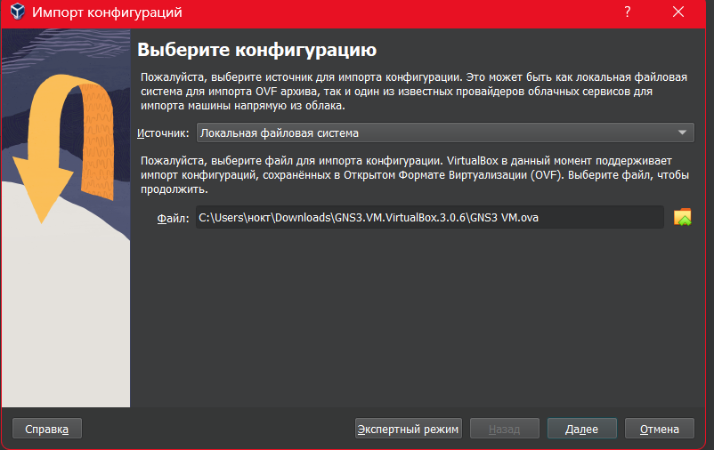{#fig:002 width=70%}

Затем указываю параметры импорта (рис. [-@fig:003]): кол-во ядер процессора(я потом поставил 4) (рис. [-@fig:004]), ОЗУ и видеопамять (рис. [-@fig:005]).

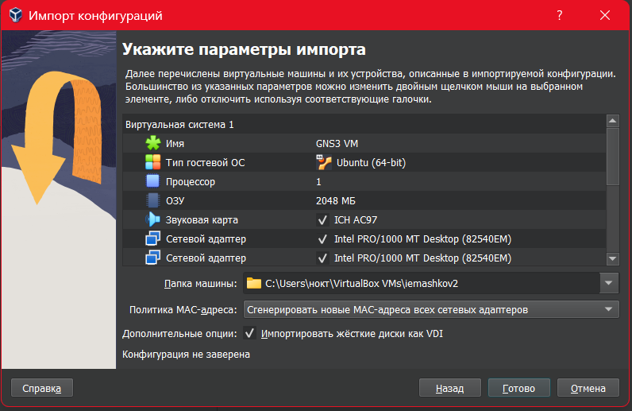{#fig:003 width=70%}

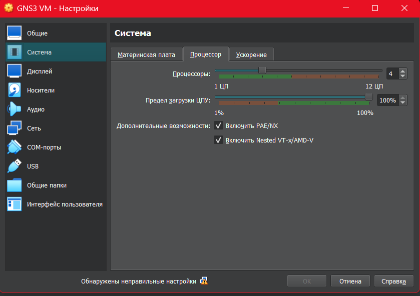{#fig:004 width=70%}

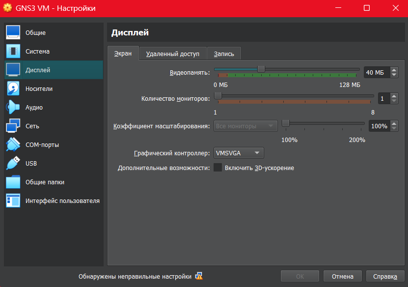{#fig:005 width=70%}

Отдельным пунктом идёт настройка сетевого адаптера (рис. [-@fig:006]). Тут нам надо выбрать виртуальный адаптер хоста и выбираем именно виртуальный адаптер самого VirtualBox.

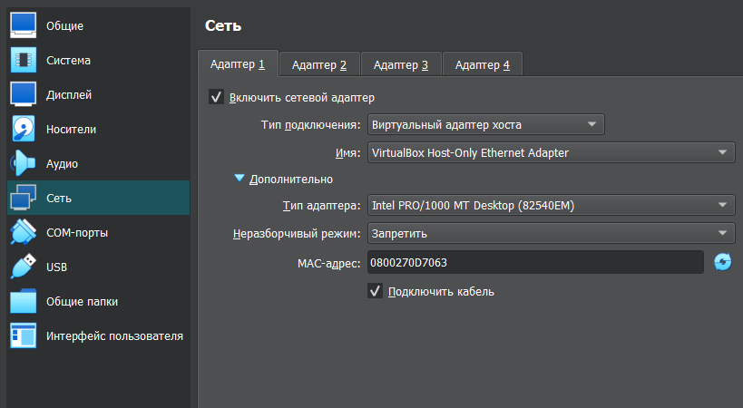{#fig:006 width=70%}

После всех настроек проводим тестовый запуск ВМ и видим, что запускается она корректно (рис. [-@fig:008]).

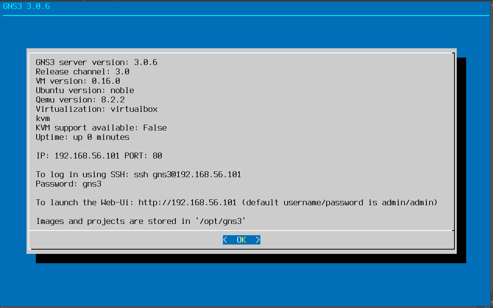{#fig:008 width=70%}

Затем переходим к настройке самого GNS3. Переходим в мастер настроек (рис. [-@fig:009]) и там нам предоставляют выбор запуска устройства на виртуальной машине.

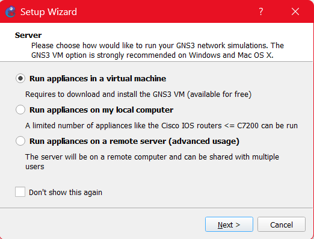{#fig:009 width=70%}

Затем проводим настройку локального сервера (рис. [-@fig:010]). Путь к серверу и порт не трогаем, но меняем IP-адрес привязки хоста (тот, что указан в окне виртуальной машины: "192.168.56.1").

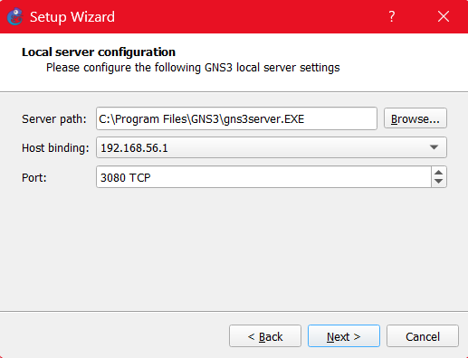{#fig:010 width=70%}

Видим финальное окно с данными виртуальной машины gns3 (рис. [-@fig:011]).

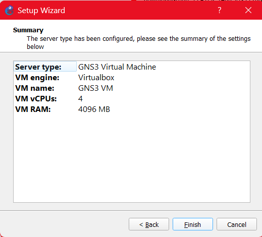{#fig:011 width=70%}

## Добавление образа маршрутизатора FRR

Затем производим добавление образа маршрутизатора FRR (рис. [-@fig:012]). В диалоговом окне выбираем установку с GNS3-сервера. Потом видим список версий маршрутизатора (рис. [-@fig:013]). Устанавливаем из интернета соответствующую версию и добавляем её, после чего она установится, о чём нас уведомит надпись о готовности к установке (рис. [-@fig:014]).

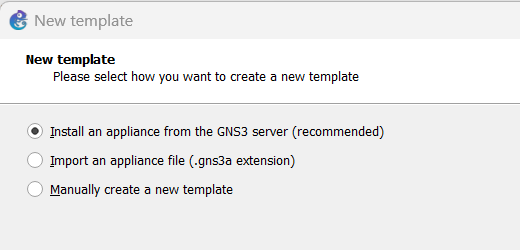{#fig:012 width=70%}

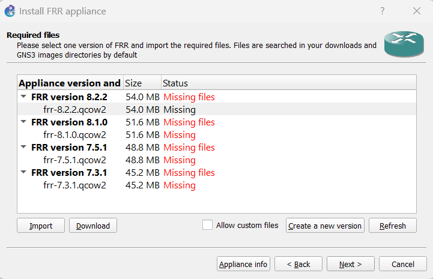{#fig:013 width=70%}

{#fig:014 width=70%}

Затем видим окно с информацией о завершении установки (рис. [-@fig:015]).

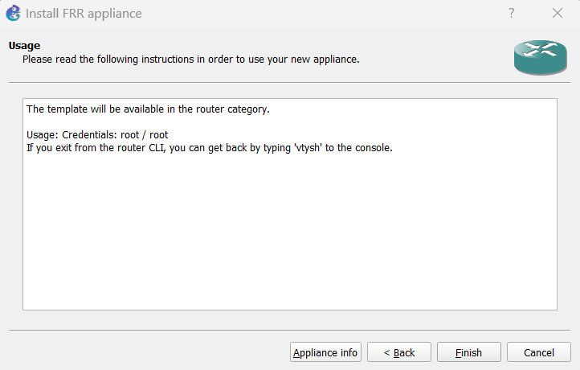{#fig:015 width=70%}

В конфигурации самого маршрутизатора нам надо поменять два параметра: в General settings меняем параметр On close (Send the shutdown signal (ACPI)) (рис. [-@fig:016]), а во вкладке HDD ставим галочку в пункте "Automatically create a config disk on HDD" (рис. [-@fig:017]).

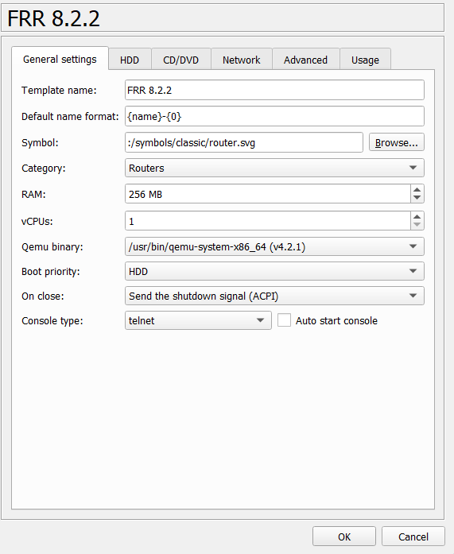{#fig:016 width=70%}

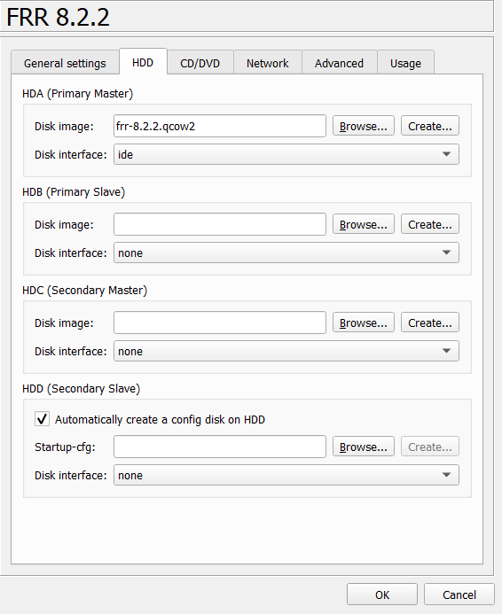{#fig:017 width=70%}

## Добавление образа маршрутизатора VyOS

Тут мы повторяем всё то, что делали в случае с FRR. Здесь мы видим версии, но в этом пункте всё не так просто. Здесь нам требуется установить версию 1.3.3, которая есть в репозитории Дмитрия Сергеевича (рис. [-@fig:018]). Дальнейшие действия те же самые, что и были запечатлены на скриншотах (рис. [-@fig:016]) и (рис. [-@fig:017]).

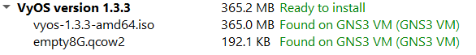{#fig:018 width=70%}

# Выводы

В ходе данной лабораторной работы я установил и настроил GNS3 и сопутствующее программное обеспечение.

# Список литературы{.unnumbered}

[Сетевые технологии](https://esystem.rudn.ru/pluginfile.php/2858183/mod_resource/content/2/004-lab_GNS3_base.pdf)
