---
## Front matter
title: "Лабораторная работа №5"
subtitle: "Сетевые технологии"
author: "Машков Илья Евгеньевич"

## Generic otions
lang: ru-RU
toc-title: "Содержание"

## Bibliography
bibliography: bib/cite.bib
csl: pandoc/csl/gost-r-7-0-5-2008-numeric.csl

## Pdf output format
toc: true # Table of contents
toc-depth: 2
lof: true # List of figures
lot: true # List of tables
fontsize: 12pt
linestretch: 1.5
papersize: a4
documentclass: scrreprt
## I18n polyglossia
polyglossia-lang:
  name: russian
  options:
	- spelling=modern
	- babelshorthands=true
polyglossia-otherlangs:
  name: english
## I18n babel
babel-lang: russian
babel-otherlangs: english
## Fonts
mainfont: PT Serif
romanfont: PT Serif
sansfont: PT Sans
monofont: PT Mono
mainfontoptions: Ligatures=TeX
romanfontoptions: Ligatures=TeX
sansfontoptions: Ligatures=TeX,Scale=MatchLowercase
monofontoptions: Scale=MatchLowercase,Scale=0.9
## Biblatex
biblatex: true
biblio-style: "gost-numeric"
biblatexoptions:
  - parentracker=true
  - backend=biber
  - hyperref=auto
  - language=auto
  - autolang=other*
  - citestyle=gost-numeric
## Pandoc-crossref LaTeX customization
figureTitle: "Рис."
tableTitle: "Таблица"
listingTitle: "Листинг"
lofTitle: "Список иллюстраций"
lotTitle: "Список таблиц"
lolTitle: "Листинги"
## Misc options
indent: true
header-includes:
  - \usepackage{indentfirst}
  - \usepackage{float} # keep figures where there are in the text
  - \floatplacement{figure}{H} # keep figures where there are in the text
---

# Цель работы

Цель данной работы — построение простейших моделей сети на базе коммутатора и маршрутизаторов FRR и VyOS в GNS3, анализ трафика посредством Wireshark.

# Задание

1. Построить в GNS3 топологию сети, состоящей из коммутатора Ethernet и двух оконечных устройств (персональных компьютеров).
2. Задать оконечным устройствам IP-адреса в сети 192.168.1.0/24. Проверить связь.
3. С помощью Wireshark захватить и проанализировать ARP-сообщения.
4. С помощью Wireshark захватить и проанализировать ICMP-сообщения.
5. Построить в GNS3 топологию сети, состоящей из маршрутизатора FRR, коммутатора Ethernet и оконечного устройства.
6. Задать оконечному устройству IP-адрес в сети 192.168.1.0/24.
7. Присвоить интерфейсу маршрутизатора адрес 192.168.1.1/24
8. Проверить связь.
9. Построить в GNS3 топологию сети, состоящей из маршрутизатора VyOS, коммутатора Ethernet и оконечного устройства.
10. Задать оконечному устройству IP-адрес в сети 192.168.1.0/24.
11. Присвоить интерфейсу маршрутизатора адрес 192.168.1.1/24
12. Проверить связь.

# Выполнение лабораторной работы

## Моделирование простейшей сети на базе коммутатора в GNS3

В GNS3 строим топологию состоящую из двух оконечных устройств (VPCS) и коммутатор (рис. [-@fig:001]).

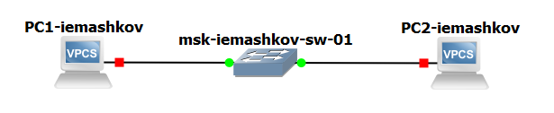{#fig:001 width=70%}

На наших ПК настраиваем IP-адреса. Для ПК1 задаём адрес 192.168.1.11 и шлюз 192.168.1.1 в сети 192.168.1.0/24 (рис. [-@fig:002]), а для ПК2 192.168.1.12 с тем же шлюзом в той же сети (рис. [-@fig:003]).

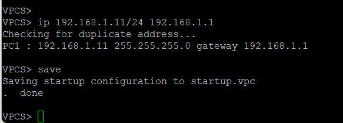{#fig:002 width=70%}

{#fig:003 width=70%}

Затем с ПК1 пингуем ПК2, а с ПК2 пингуем ПК1 (рис. [-@fig:008]). Как мы видим, всё уходит и доставляется.

{#fig:008 width=70%}

## Анализ трафика в GNS3 посредством Wireshark

Запускаем захват трафика на соединении ПК1 и комутатора. В Wireshark видим ARP-пакеты отправленные с мак-адреса Private на широковещательный адрес (рис. [-@fig:010]).

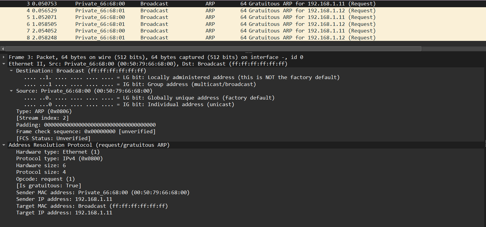{#fig:010 width=70%}

Затем в терминале ПК2 мы делаем эхо запрос в ICMP-моде к узлу ПК1 (рис. [-@fig:011]).

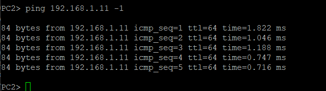{#fig:011 width=70%}

В Wireshark просматриваем полученые icmp-пакеты (рис. [-@fig:012]). Как мы можем заметить, что запрос отправляется с 192.168.1.12 на 192.168.1.11, а ответ с .11 на .12. Мак-адреса обоих устройств уникальны и глобально администрируемы.

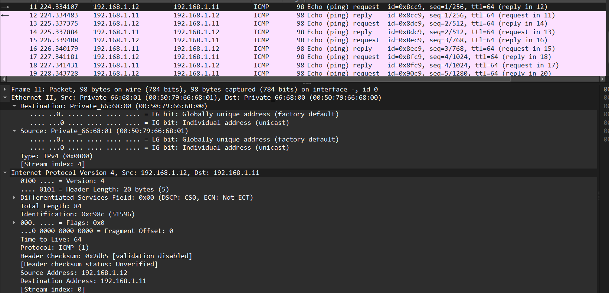{#fig:012 width=70%}

Затем с ПК2 делаем эхо-запрос к узлу ПК1 в UDP-моде (рис. [-@fig:013]).

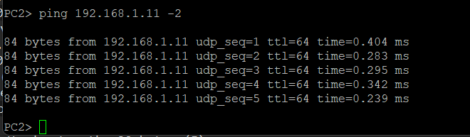{#fig:013 width=70%}

В Wireshark мы видим наши UDP-пакеты, которые содержат те же IP и MAC адреса. Тот же размер сообщение и пр.(рис. [-@fig:014]).

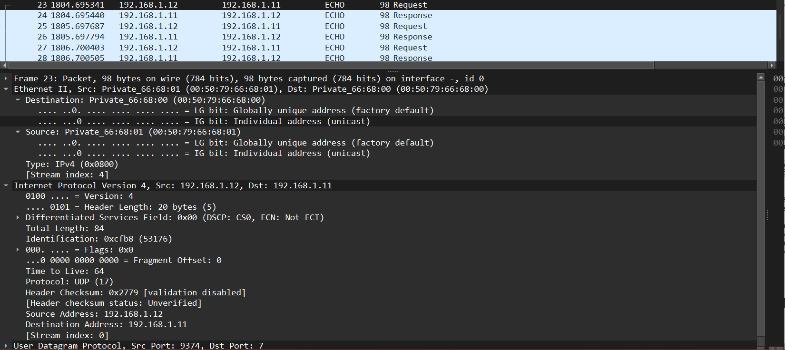{#fig:014 width=70%}

Делаем эхо-запрос в TCP-моде с ПК2 на узел ПК1 (рис. [-@fig:015]).

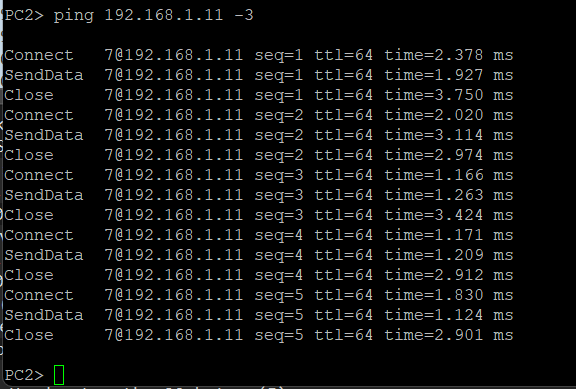{#fig:015 width=70%}

В Wireshark мы видим наши TCP-пакеты, которые содержат те же самые адреса (MAC и IP) (рис. [-@fig:016]). Также мы можем заметить характерную для TCP-пакетов информацию - трёхступенчатое рукопожатие. В данном случае ACK = 1.

{#fig:016 width=70%}

## Моделирование простейшей сети на базе маршрутизатора FRR в GNS3

Строим топологию с VPC, коммутатором и маршрутизатором FRR (рис. [-@fig:017]).

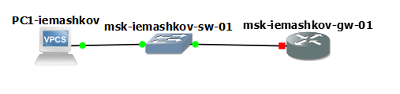{#fig:017 width=70%}

Настраиваем для ПК1 адрес 192.168.1.10 с шлюзом 192.168.1.1 в сети 192.168.1.0/24 (рис. [-@fig:019]).

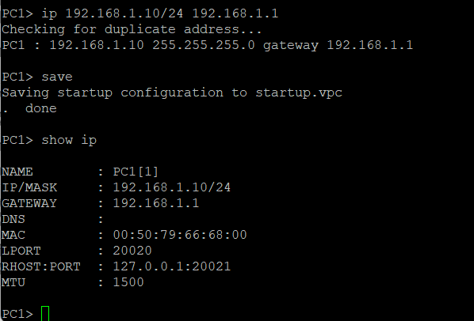{#fig:019 width=70%}

На FRR настраиваем IP-адресацию для интерфейса локальной сети маршрутизатора, и проверяем его конфигурацию (там всё так, как нам и надо) (рис. [-@fig:020]).

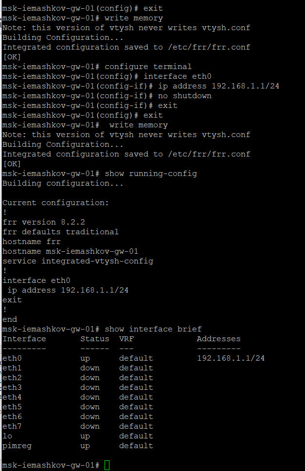{#fig:020 width=70%}

Просматриваем ICMP-пакеты на узле ПК1 (рис. [-@fig:021]) и (рис. [-@fig:022]) после отправки стандартных эхо-запросов с ПК1 на адрес "192.168.1.1". Мы видим IP-адрес ПК1 192.168.1.10 и адрес шлюза 192.168.1.1. Оба мак-адреса уникальные и глобально администрируемы. 

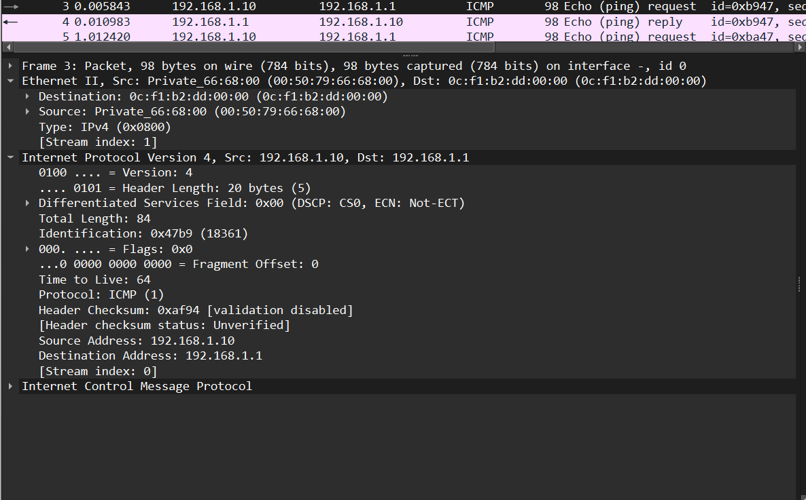{#fig:021 width=70%}

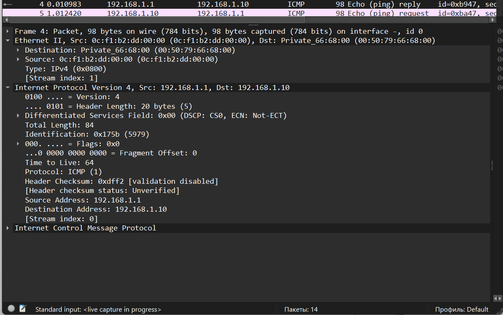{#fig:022 width=70%}

## Моделирование простейшей сети на базе маршрутизатора VyOS в GNS3

Строим топологию с VPC, комутатором и маршрутизатором VyOS. Выглядит она так же, как и на этом скриншоте (рис. [-@fig:017]).

Настраиваем IP-адрес на ПК1 192.168.1.10 с шлюзом 192.168.1.1 в сети 192.168.1.0/24 (рис. [-@fig:023]).

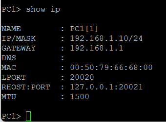{#fig:023 width=70%}

Устанавливаем на VyOS, меняем имя устройства на моё - msk-iemashkov-gw-01. Затем задаём адрес 192.168.1.1 на интерфейсе eth0, применяем изменения конфигурации и сохраняем, а также выводим информацию об интерфейсах маршрутизатора (рис. [-@fig:024]).

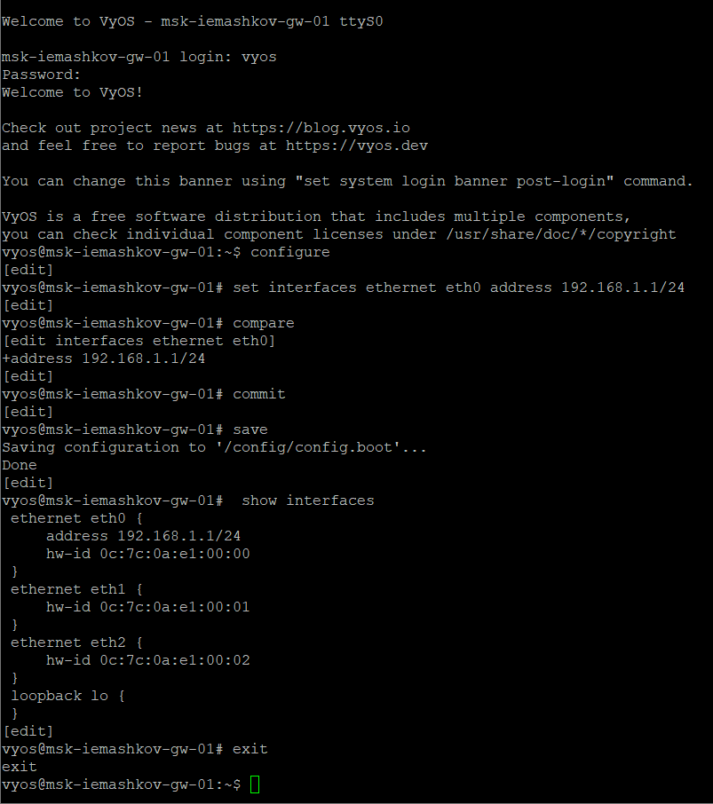{#fig:024 width=70%}

Затем просматриваем ICMP-пакеты на узле ПК1 (рис. [-@fig:025]) и (рис. [-@fig:026]) после отправки стандартных эхо-запросов с ПК1 на адрес "192.168.1.1". Видим IP и MAC адреса ПК1 и VyOS. MAC-адреса уникальны и глобально администрируемы.

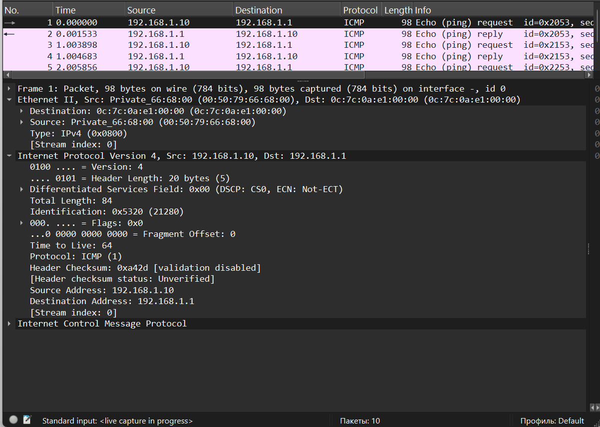{#fig:025 width=70%}

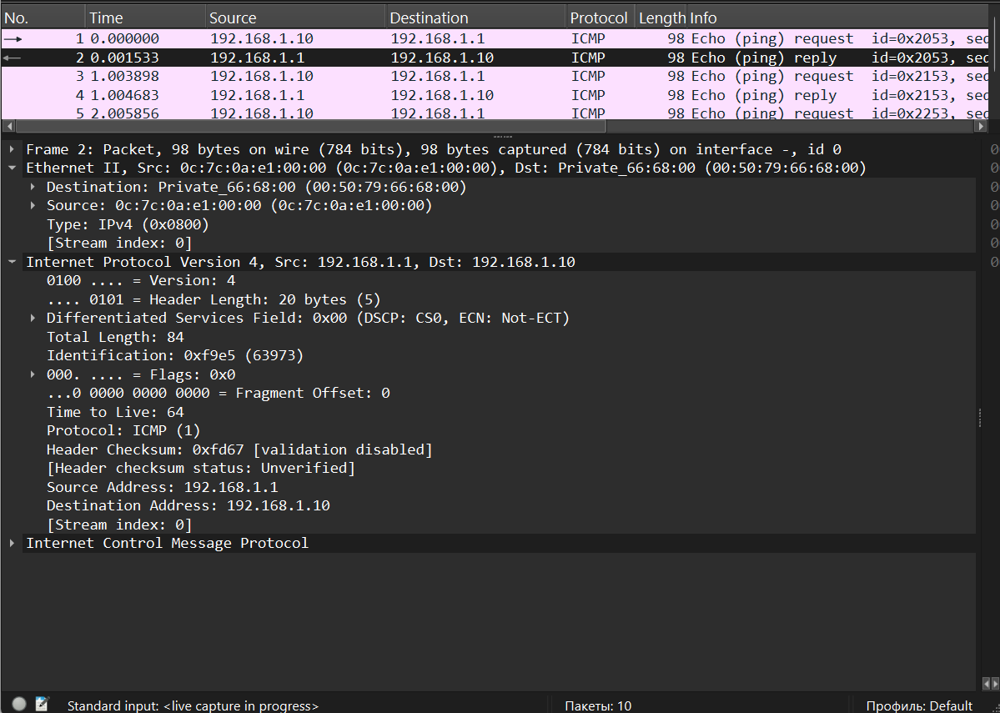{#fig:026 width=70%}

# Выводы

За время выполнения данной лабораторной работы я научился строить простейшие модели сети на базе коммутатора и маршрутизаторов FRR и VyOS в GNS3, анализировать трафика посредством Wireshark.

# Список литературы{.unnumbered}

[Сетевые технологии](https://esystem.rudn.ru/pluginfile.php/2858187/mod_resource/content/2/005-lab_datalink-layer-GNS3-WSh.pdf)
