---
## Front matter
title: "Лабораторная работа №6"
subtitle: "Сетевые технологии"
author: "Машков Илья Евгеньевич"

## Generic otions
lang: ru-RU
toc-title: "Содержание"

## Bibliography
bibliography: bib/cite.bib
csl: pandoc/csl/gost-r-7-0-5-2008-numeric.csl

## Pdf output format
toc: true # Table of contents
toc-depth: 2
lof: true # List of figures
lot: true # List of tables
fontsize: 12pt
linestretch: 1.5
papersize: a4
documentclass: scrreprt
## I18n polyglossia
polyglossia-lang:
  name: russian
  options:
	- spelling=modern
	- babelshorthands=true
polyglossia-otherlangs:
  name: english
## I18n babel
babel-lang: russian
babel-otherlangs: english
## Fonts
mainfont: PT Serif
romanfont: PT Serif
sansfont: PT Sans
monofont: PT Mono
mainfontoptions: Ligatures=TeX
romanfontoptions: Ligatures=TeX
sansfontoptions: Ligatures=TeX,Scale=MatchLowercase
monofontoptions: Scale=MatchLowercase,Scale=0.9
## Biblatex
biblatex: true
biblio-style: "gost-numeric"
biblatexoptions:
  - parentracker=true
  - backend=biber
  - hyperref=auto
  - language=auto
  - autolang=other*
  - citestyle=gost-numeric
## Pandoc-crossref LaTeX customization
figureTitle: "Рис."
tableTitle: "Таблица"
listingTitle: "Листинг"
lofTitle: "Список иллюстраций"
lotTitle: "Список таблиц"
lolTitle: "Листинги"
## Misc options
indent: true
header-includes:
  - \usepackage{indentfirst}
  - \usepackage{float} # keep figures where there are in the text
  - \floatplacement{figure}{H} # keep figures where there are in the text
---

# Цель работы

Цель данной работы — изучение принципов распределения и настройки адресного пространства на устройствах сети.

# Выполнение лабораторной работы

## Разбиение сети на подсети

### Разбиение IPv4-сети на подсети

Работаем с сетью 172.16.20.0/24. Маска данной сети 255.255.255.0 (рис. [-@fig:001]).

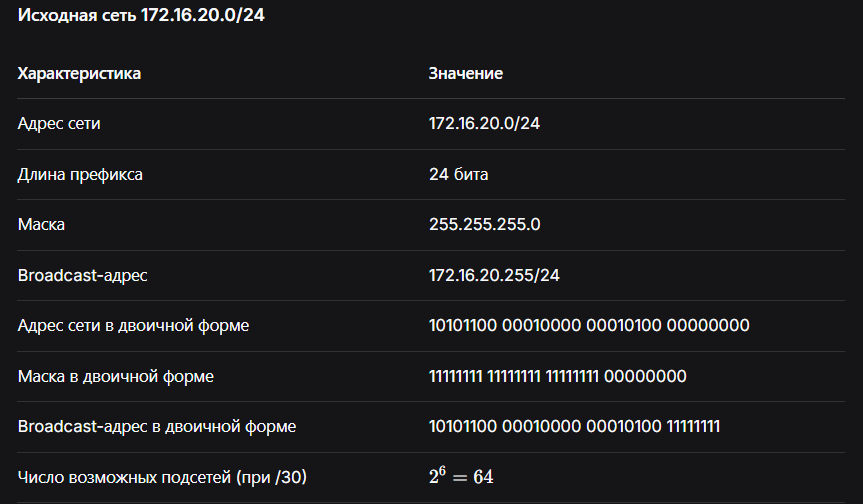{#fig:001 width=70%}

Если мы рассматриваем сеть с 126-ью узлами, то мы имеем 128 адресов, т.к. 2 доп. сети это broadcast и адрес самой сети. Маска будет следующей: 255.255.255.128. Broadcast адрес 172.16.20.127 (префикс - /25). Диапазон адресов будет от .1 до .126  (рис. [-@fig:002]).

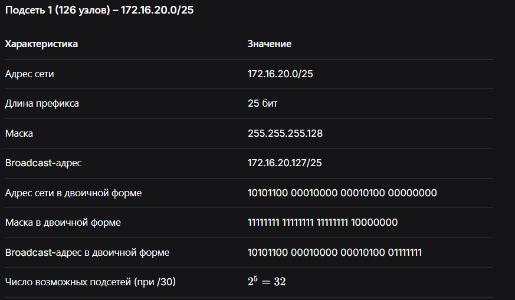{#fig:002 width=70%}

Теперь случай с 62-мя узлами, т.е. мы имеем 64 адреса, маску 255.255.255.192, broadcast .191 с префиксом /26, а диапазон сетей от .129 до .190 (рис. [-@fig:003]).

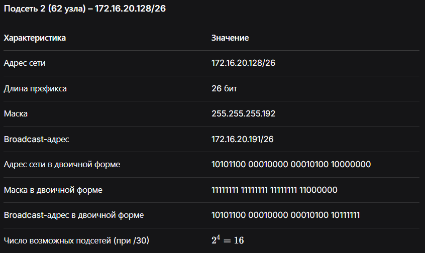{#fig:003 width=70%}

В этом случае диапазон сетей будет от .193 до .254. Префикс будет таким же, адрес будет 172.16.20.192. Броадкаст-адрес будет 172.16.20.255 (рис. [-@fig:004]).

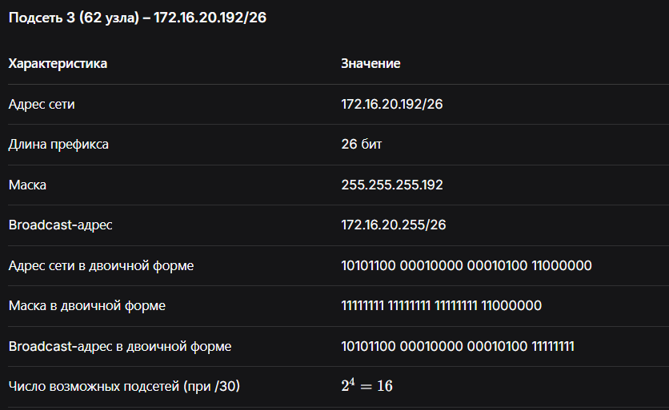{#fig:004 width=70%}

Теперь работаем с сетью 10.10.1.64/26 (рис. [-@fig:005]).

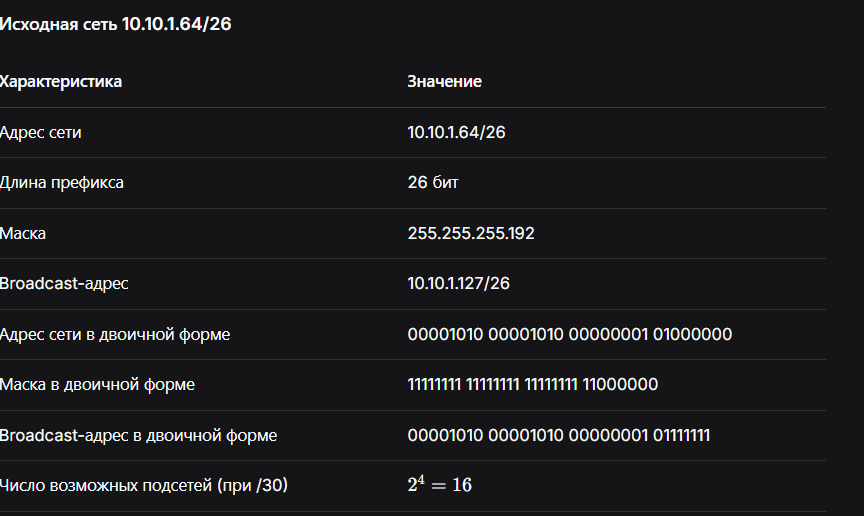{#fig:005 width=70%}

Рассматриваем случай с 30-ью узлами. Имеем, в сумме, 32 адреса. Маска сети 255.255.255.224, широковещательный адрес .95 с префиксом /27. Диапазон сетей от .65 до .94 (рис. [-@fig:006]).

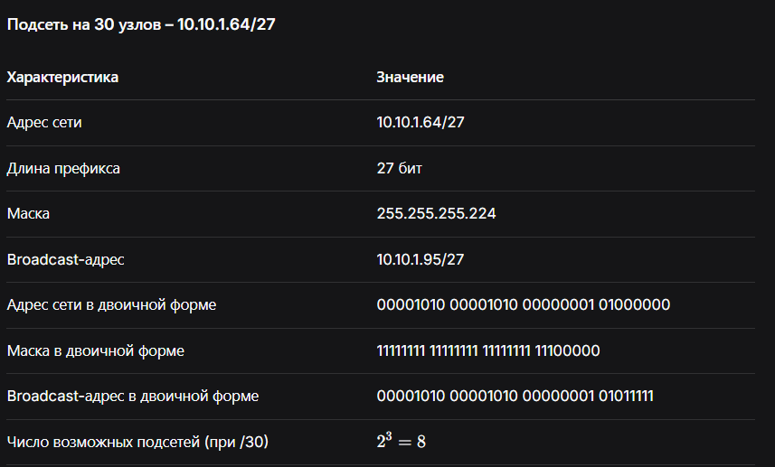{#fig:006 width=70%}

Теперь поработаем с сетью 10.10.1.0/26. Маска 255.255.255.192, префикс /26 (рис. [-@fig:007]).

{#fig:007 width=70%}

Нас интересует случай с 14-ью узлами. Имеем 16 адресов. Маска 255.255.255.240, префикс /28, адрес сети - 10.10.1.0/28, широковещательный адрес - 10.10.1.15/28, диапазон адресов от .1 до .14 (рис. [-@fig:008]).

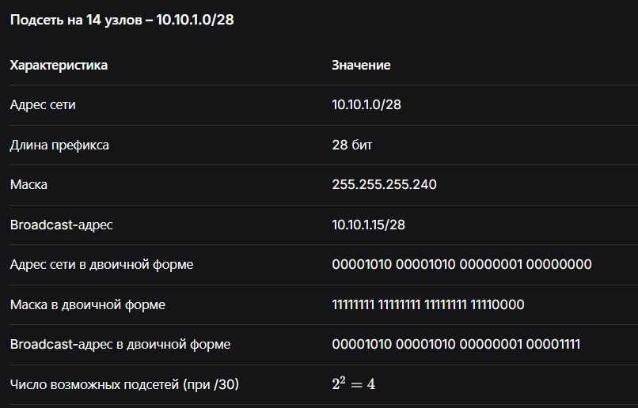{#fig:008 width=70%}

### Разбиение IPv6-сети на подсети

Нам задна сеть 2001:db8:c0de::/48 (рис. [-@fig:009]).

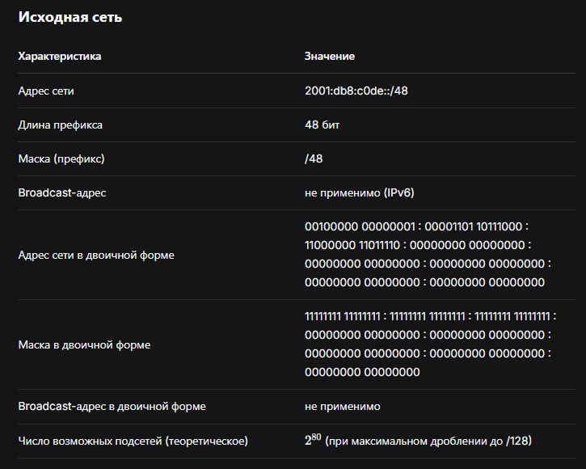{#fig:009 width=70%}

Разбить эту сеть на две подсети двумя способами: с использованием индентификатора подсети или с индентификатором интерфейса. Здесь будет изображен способ с использованием индентификатора подсети. Заимствуем 1 бит из SubnetID, получаем префикс /49. После этого получаем две подсети с адресами 2001:db8:c0de::/49 (рис. [-@fig:010]) и 2001:db8:c0de:8000::/49 (рис. [-@fig:011]).

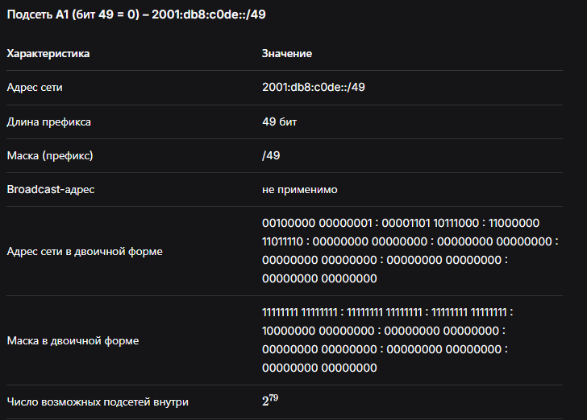{#fig:010 width=70%}

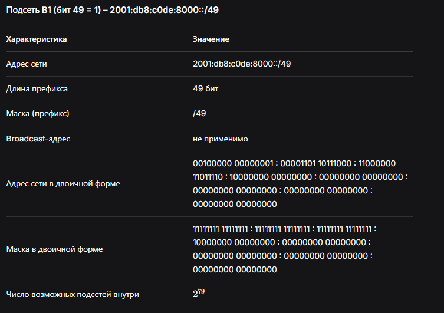{#fig:011 width=70%}

Теперь используем индентификатор интерфейса. Заимствуем 1 бит из InterfaceID: получаем префикс /65. Таким образом имеем два адреса: 2001:db8:c0de::/65 (рис. [-@fig:012]) и 2001:db8:c0de:0:8000::/49 (рис. [-@fig:013]).

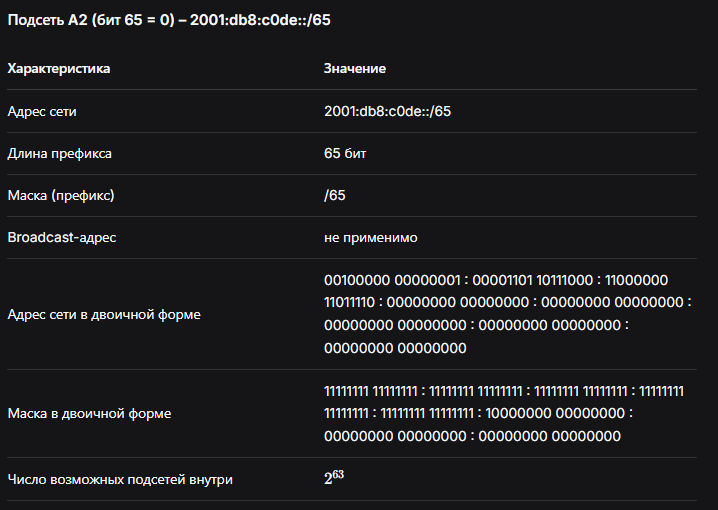{#fig:012 width=70%}

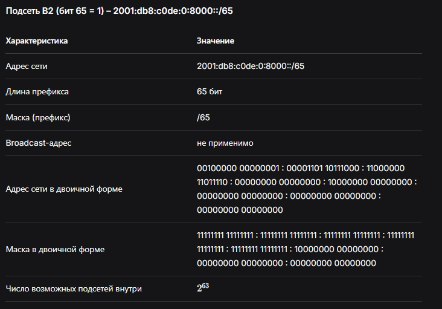{#fig:013 width=70%}

Теперь работаем с сетью 2a02:6b8::/64. Разбитие производится таким же образом (рис. [-@fig:014]).

{#fig:014 width=70%}

Используем биты из индентификатора подсети. Получаем префикс /65. Получаем два адреса: 2a02:6b8::/65 (рис. [-@fig:015]) и 2a02:6b8:0:0:8000::/65 (рис. [-@fig:016]).

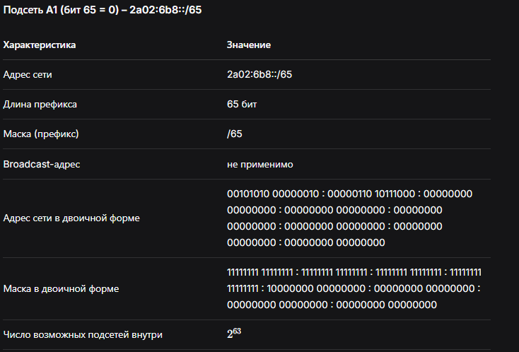{#fig:015 width=70%}

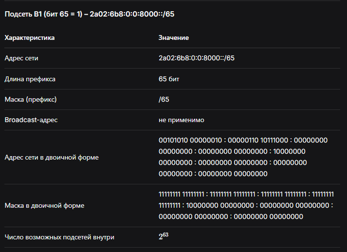{#fig:016 width=70%}

В случае с индентификатором интерфейса ситуация следующая. Мы заимствуем два бита из индентификатора интерфейса, получаем префикс /66. И получаем два адреса: 2a02:6b8::/66 (рис. [-@fig:017]) и 2a02:6b8:0:0:4000::/66 (рис. [-@fig:018]).

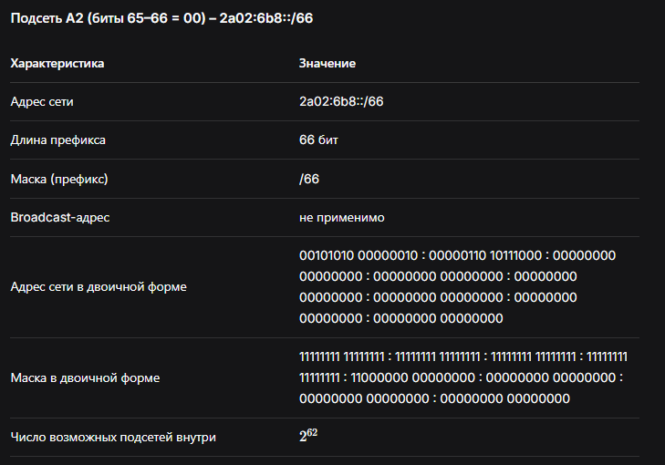{#fig:017 width=70%}

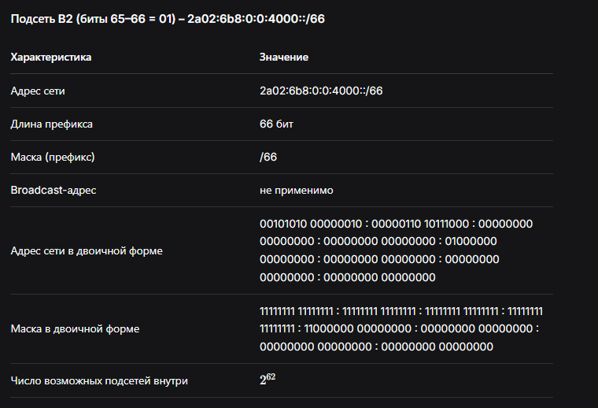{#fig:018 width=70%}

## Настройка двойного стека адресации IPv4 и IPv6 в локальной сети

Запускаем ВМ и GNS3 и строим топологию сети с IPv4 и IPv6 сетями (рис. [-@fig:019]). Два ПК(1 и 2) будут иметь ipv4 адреса, а роутер этой подсети будет иметь ipv4-адресацию. Два ПК(3 и 4) во второй подсети будут иметь ipv6-адрес, роутер будет иметь ipv6-адресацию. А сервер мы настраиваем на двойной стек, т.е. он будет принимать запросы из первой ipv4-подсети и из второй ipv6-подсети. 

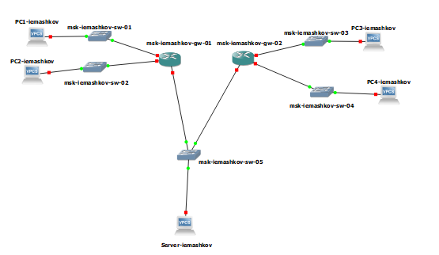{#fig:019 width=70%}

Настраиваем ipv4-адреса для ПК1 172.16.20.10/25 (шлюз 172.16.20.1) и ПК2 172.16.20.138/25 (шлюз 172.16.20.129) (рис. [-@fig:020]). А потом проверяем корректность нашей настройки (рис. [-@fig:021]).

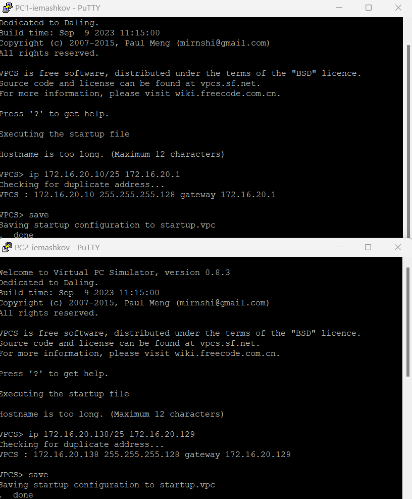{#fig:020 width=70%}

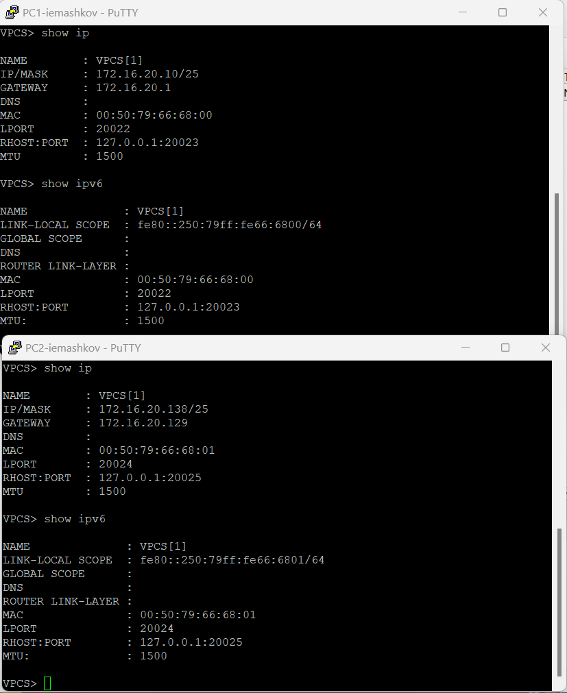{#fig:021 width=70%}

В ipv4-подсети у нас стоит роутер FRR, на котором мы настраиваем IPv4-адресацию (рис. [-@fig:022]). Потом просматриваем корректность проделаных изменений (рис. [-@fig:023]).

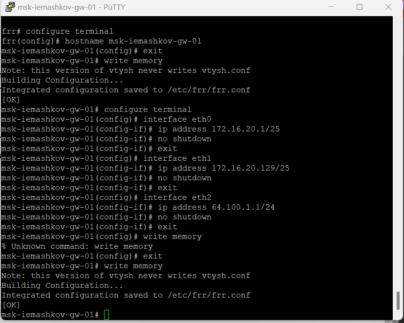{#fig:022 width=70%}

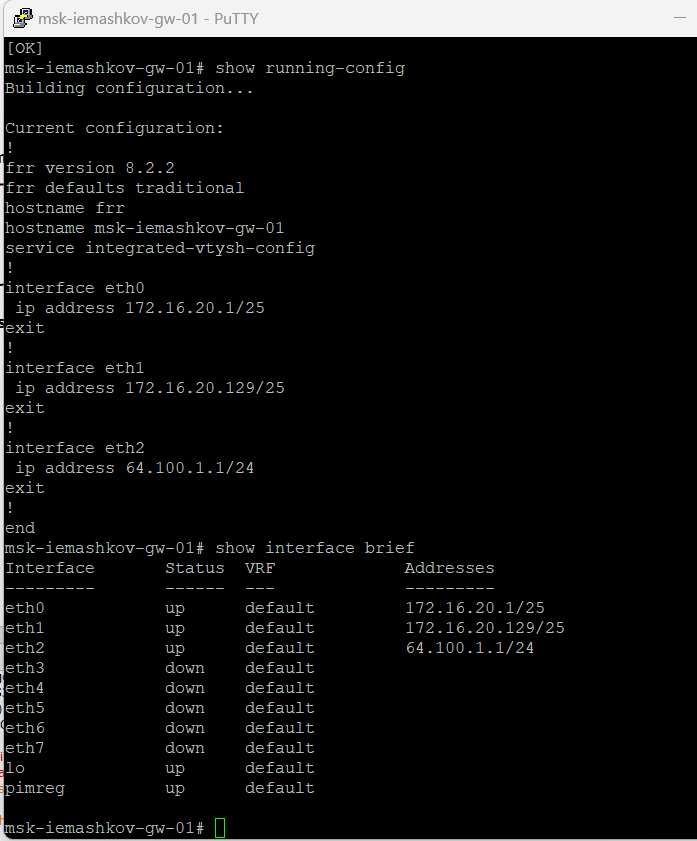{#fig:023 width=70%}

Проверяем работоспособность сообщения между ПК1 и ПК2 обоюдной отправкой эхо-запросов (рис. [-@fig:024]).

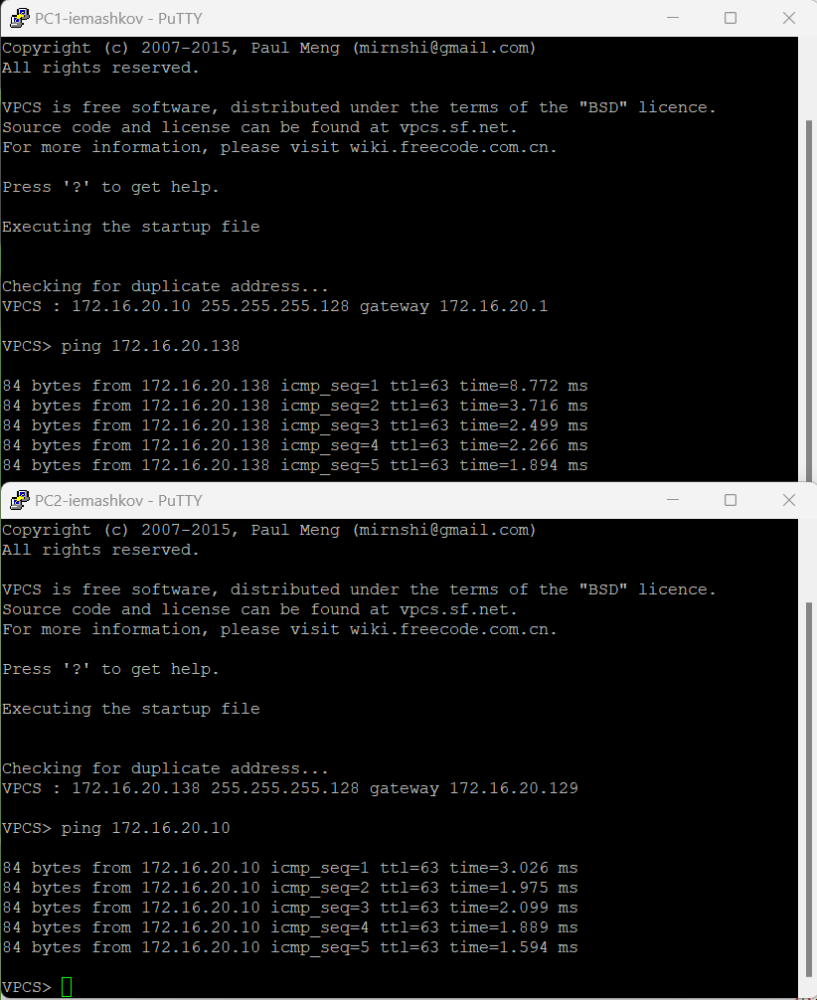{#fig:024 width=70%}

Теперь настраиваем нашу вторую подсеть: даём IPv6-адрес для ПК3 2001:db8:c0de:12::a/64 (шлюз - интерфейс роутера gw-02) и ПК4 2001:db8:c0de:13::a/64 (шлюз - интерфейс роутера gw-02) (рис. [-@fig:025]). Затем просматриваем наши сохранённые изменения (рис. [-@fig:026]).

{#fig:025 width=70%}

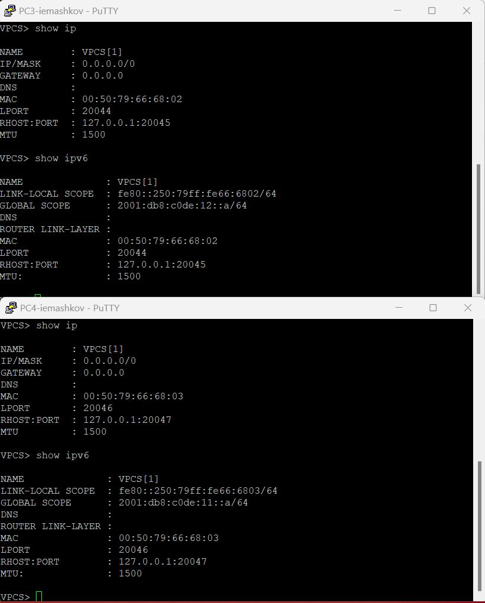{#fig:026 width=70%}

На роутере VyOS настраиваем IPv6-адресацию (рис. [-@fig:027]). И проверяем наши параметры (рис. [-@fig:028]).

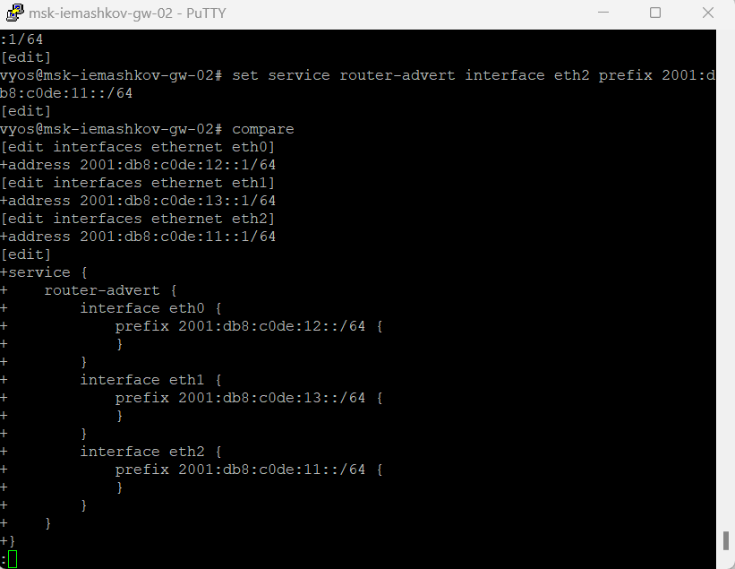{#fig:027 width=70%} 

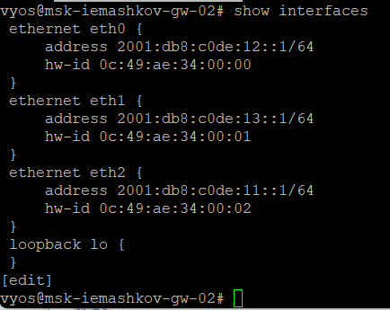{#fig:028 width=70%}

Проверяем работоспособность нашей ipv6-подсети. Производим обоюдную отпраку эхо-запросов с двух ПК в этой подсети и пробуем пингануть сервер, но попытка будет неудачной, потому что мы его не настроили (рис. [-@fig:029]).

{#fig:029 width=70%}

После настройки сервера мы проверяем работоспособность всей топологии (рис. [-@fig:030]). Всё хорошо работает. В WireShark мы увидим ARP, ICMP, ICMPv6 пакеты, где будут указаны наши ip адреса, мак-адреса, которые будут уникальными и глобально администрируемы.

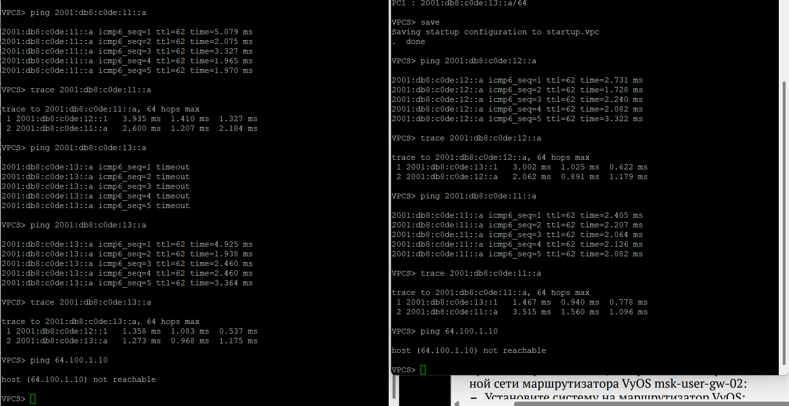{#fig:030 width=70%}

## Задание для самостоятельного выполнения

Создаём новую топологию с двумя оконечными устройствами ПК1 и ПК2 и одним маршрутизатором, который будет разбивать сеть на подсети с IPv4 и IPv6 адресами (рис. [-@fig:031]).

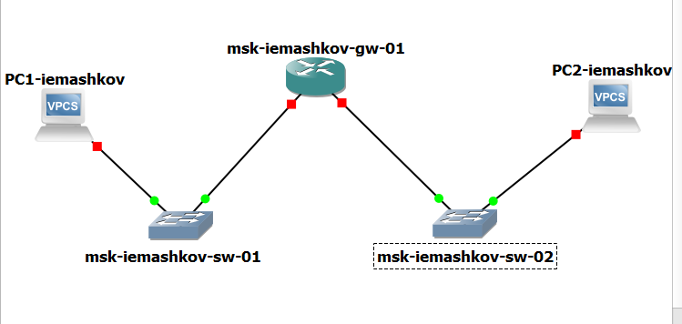{#fig:031 width=70%}

Задаём для ПК1 IPv4-адрес 10.10.1.98/27 (шлюз 10.10.1.97) и IPv6-адрес 2001:DB8:1:1::2/64 (рис. [-@fig:032]).

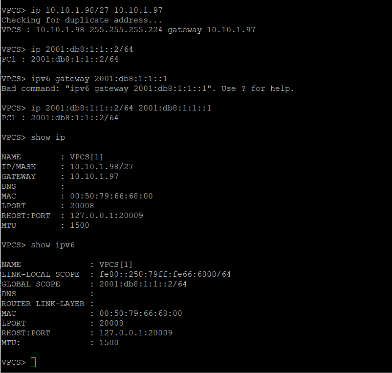{#fig:032 width=70%}

Задаём для ПК1 IPv4-адрес 10.10.1.18/28 (шлюз 10.10.1.17) и IPv6-адрес 2001:DB8:1:4::2/64 (рис. [-@fig:033]).

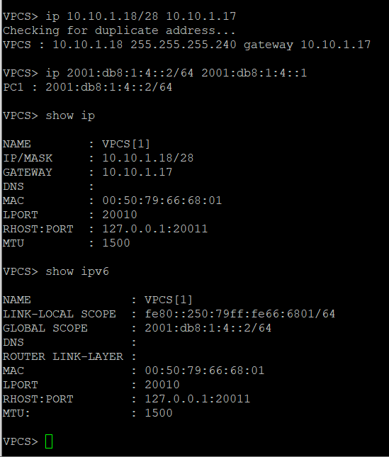{#fig:033 width=70%}

На роутере настраиваем IPv4 и IPv6 адресацию (рис. [-@fig:034]).

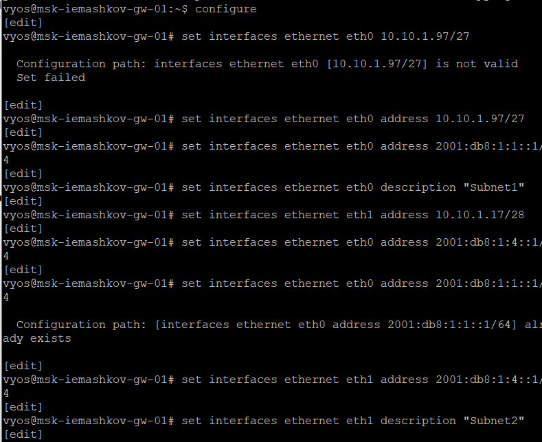{#fig:034 width=70%}

Просматриваем информацию по нашим интерфейсам (рис. [-@fig:035]).

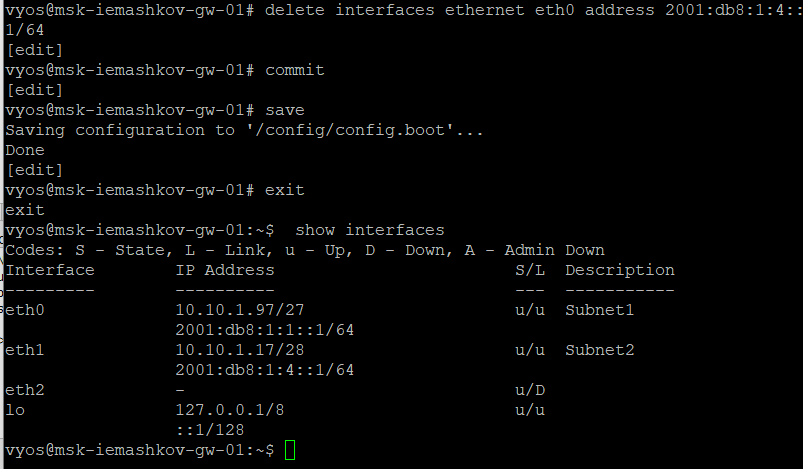{#fig:035 width=70%}

Производим обоюдную отправку эхо-запросов с ПК1 и ПК2 по обоим адресам (рис. [-@fig:036]), (рис. [-@fig:037]).

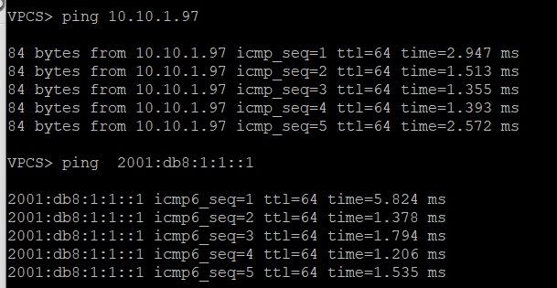{#fig:036 width=70%}

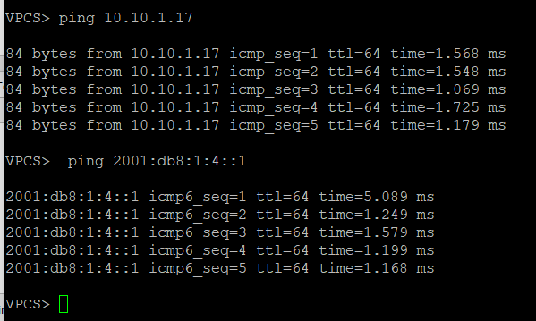{#fig:037 width=70%}

Произвожу нормальную настройку IPv6-адресации, потому что в первый раз я сделал это неправильно (рис. [-@fig:038]).

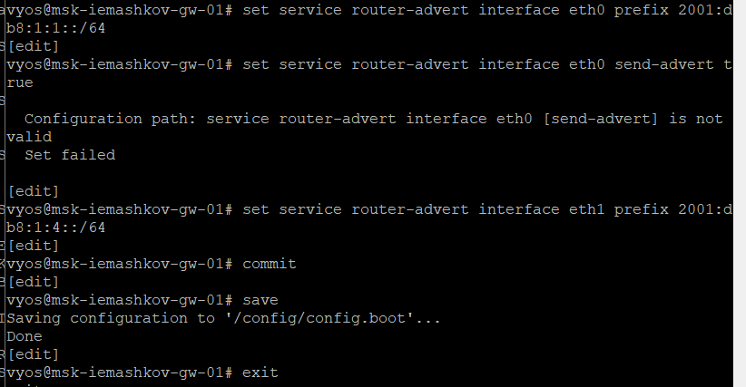{#fig:038 width=70%}

После нормальной настройки обе команды: ping и trace начали нормально работать (рис. [-@fig:039]).

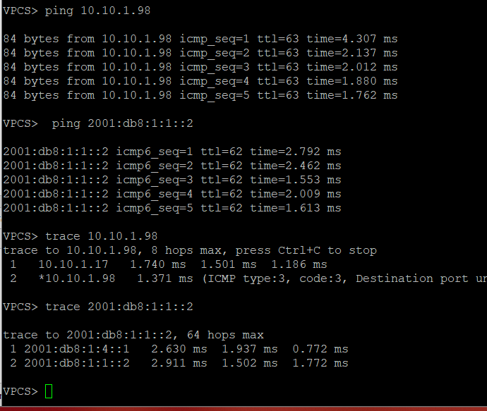{#fig:039 width=70%}

# Выводы

В ходе данной лабораторной работы мной были изучены принципы распределения и приобретены навыки по настройке адресного пространства на устройствах сети.

# Список литературы{.unnumbered}

[Сетевые технологии](https://esystem.rudn.ru/pluginfile.php/2858191/mod_resource/content/2/006-lab_ipv4-ipv6-addr-GNS3.pdf)
