---
## Front matter
title: "Лабораторная работа №7"
subtitle: "Сетевые технологии"
author: "Машков Илья Евгеньевич"

## Generic otions
lang: ru-RU
toc-title: "Содержание"

## Bibliography
bibliography: bib/cite.bib
csl: pandoc/csl/gost-r-7-0-5-2008-numeric.csl

## Pdf output format
toc: true # Table of contents
toc-depth: 2
lof: true # List of figures
lot: true # List of tables
fontsize: 12pt
linestretch: 1.5
papersize: a4
documentclass: scrreprt
## I18n polyglossia
polyglossia-lang:
  name: russian
  options:
	- spelling=modern
	- babelshorthands=true
polyglossia-otherlangs:
  name: english
## I18n babel
babel-lang: russian
babel-otherlangs: english
## Fonts
mainfont: PT Serif
romanfont: PT Serif
sansfont: PT Sans
monofont: PT Mono
mainfontoptions: Ligatures=TeX
romanfontoptions: Ligatures=TeX
sansfontoptions: Ligatures=TeX,Scale=MatchLowercase
monofontoptions: Scale=MatchLowercase,Scale=0.9
## Biblatex
biblatex: true
biblio-style: "gost-numeric"
biblatexoptions:
  - parentracker=true
  - backend=biber
  - hyperref=auto
  - language=auto
  - autolang=other*
  - citestyle=gost-numeric
## Pandoc-crossref LaTeX customization
figureTitle: "Рис."
tableTitle: "Таблица"
listingTitle: "Листинг"
lofTitle: "Список иллюстраций"
lotTitle: "Список таблиц"
lolTitle: "Листинги"
## Misc options
indent: true
header-includes:
  - \usepackage{indentfirst}
  - \usepackage{float} # keep figures where there are in the text
  - \floatplacement{figure}{H} # keep figures where there are in the text
---

# Цель работы

Цель данной работы — получение навыков настройки службы DHCP на сетевом оборудовании для
распределения адресов IPv4 и IPv6.

# Выполнение лабораторной работы

## Настройка DHCP в случае IPv4

Строим топологию с ПК1, коммутатором и маршрутизатором VyOS, на которой мы будем настраивать получение адреса по DHCP (рис. [-@fig:001]).

{#fig:001 width=70%}

Настраиваем имя хоста на роутере и устанавливаем систему (рис. [-@fig:002]).

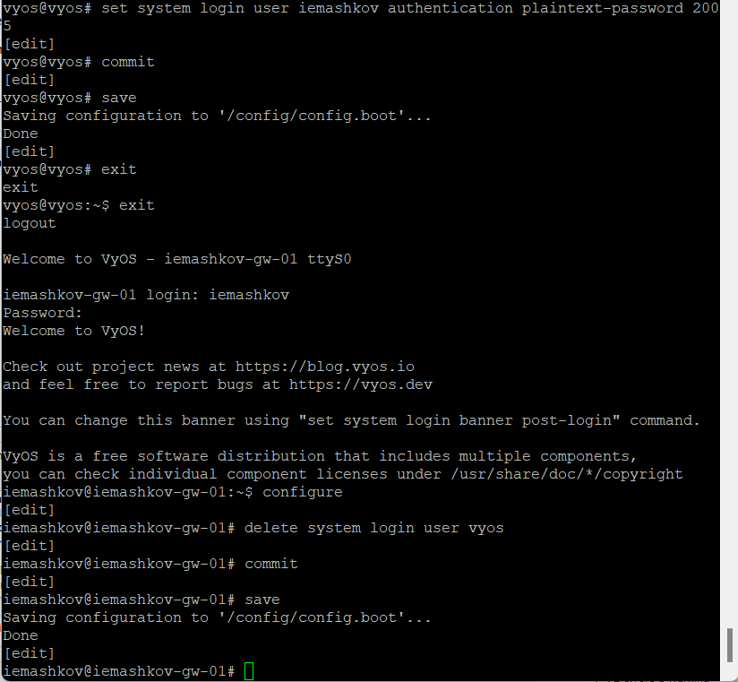{#fig:002 width=70%}

На роутере настраиваем IPv4-адресацию на интерфейсе eth0, добавляем конфигурацию DHCP-сервера на маршрутизаторе: мы создали разделяемую сеть с названием iemashkov, подсеть с адресом 10.0.0.0/24, задаём диапазон адресов с именем hosts, содержащий адреса 10.0.0.2 – 10.0.0.253. И после всех этих действий проверяем статистику DHCP-сервера (рис. [-@fig:003]) и выданных адресов (рис. [-@fig:004]).

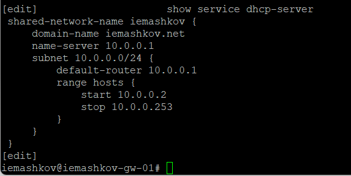{#fig:003 width=70%}

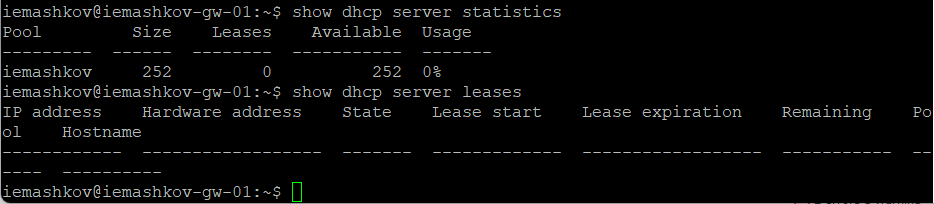{#fig:004 width=70%}

На ПК1 производим настройку с помощью DHCP. Опция -d позволяет просмотреть декодированные запросы DHCP (рис. [-@fig:005]). Видим, что было два запроса от ПК1, потом пришёл ответ с полученным IPv4-адресом 10.0.0.2/24 от DHCP-сервера с адресом 10.0.0.1.

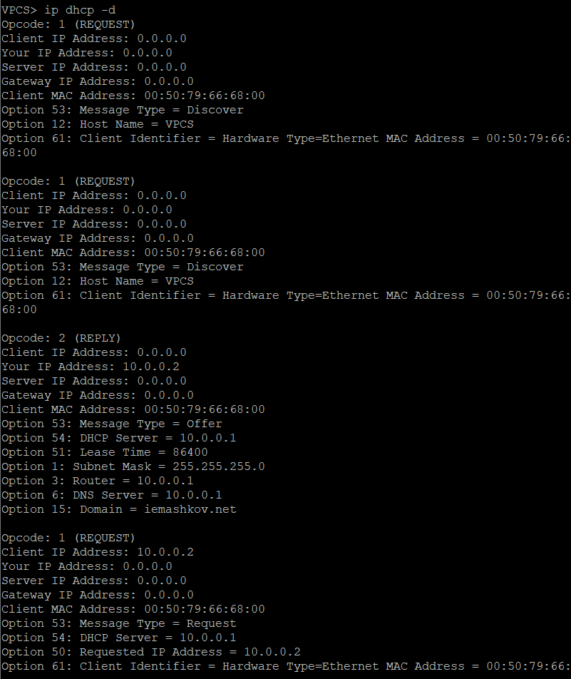{#fig:005 width=70%}

После этих изменений просматриваем ip-адреса самого ПК1 (рис. [-@fig:006]). Видим, что Был настроен IPv4-адрес, шлюз, DNS и DHCP сервер, имя домена и т.д.

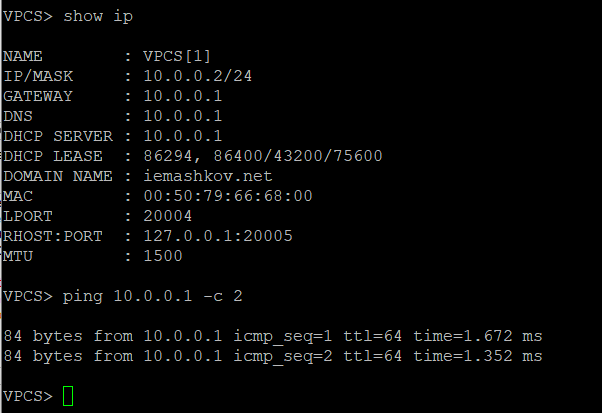{#fig:006 width=70%}

Снова просматриваем статистику и выданные адреса (рис. [-@fig:007]). Видим, что был выдан один адрес для ПК1, поэтому теперь в доступных адресах стало на один меньше (было 252, стало 251). Адрес 10.0.0.2 - первый из нашего диапазона, который будет существовать 24 часа.

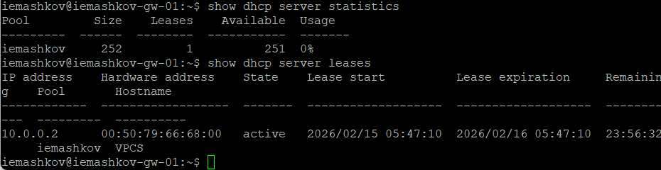{#fig:007 width=70%}

Открываем логи DHCP-сервера и наблюдаем наш эхо-запрос (рис. [-@fig:008]).

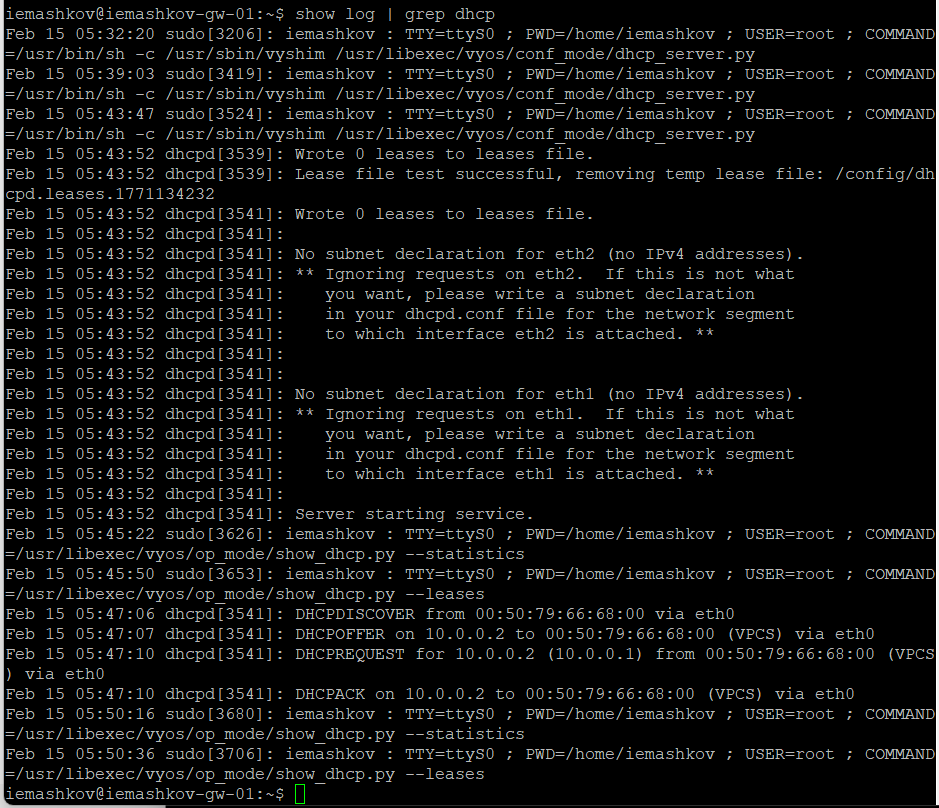{#fig:008 width=70%}

В WireShark просматриваем DHCP-пакеты (рис. [-@fig:009]).

{#fig:009 width=70%}

Видим ответ клиенту на адрес 10.0.0.2, мак-адрес. А также мы видим надпись DHCP-OFFER, которая говорит о некотором выданном адресе DHCP-клиенту на определённое время и т.д.

## Настройка DHCP в случае IPv6

Строим новую топологию для настройки DHCP в случае IPv6 (рис. [-@fig:010]). Здесь нам потребуется один обычный VPC, маршрутизатор VyOS, коммутаторы на всех соединениях (3) и два хоста alpine linux, т.к. этот хост поддерживает DHCPv6

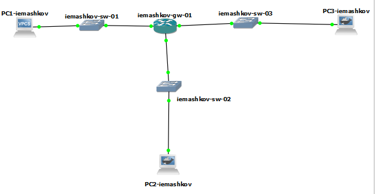{#fig:010 width=70%}

Настраиваем IPv6-адресацию на маршрутизаторе (рис. [-@fig:011]).

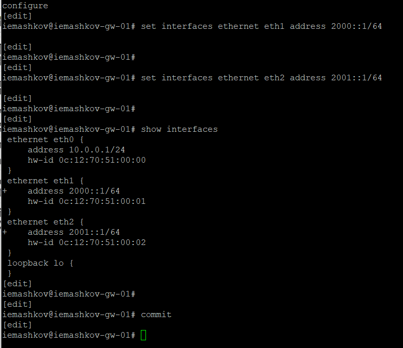{#fig:011 width=70%}

Теперь настраиваем DHCPv6 без отслеживания состояния: настраиваем объявления о маршрутизаторах (рис. [-@fig:012]), добавляем конфигурацию DHCP-сервера (создаём разделяемую сеть, задаём информацию общих опций) (рис. [-@fig:013]).

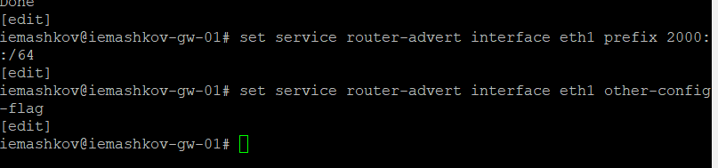{#fig:012 width=70%}

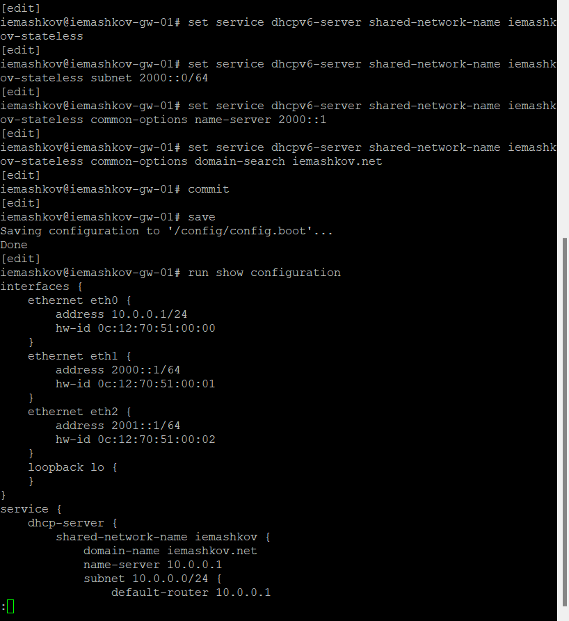{#fig:013 width=70%}

На ПК2 проверяем настройки сети через обычную консоль (рис. [-@fig:014]).

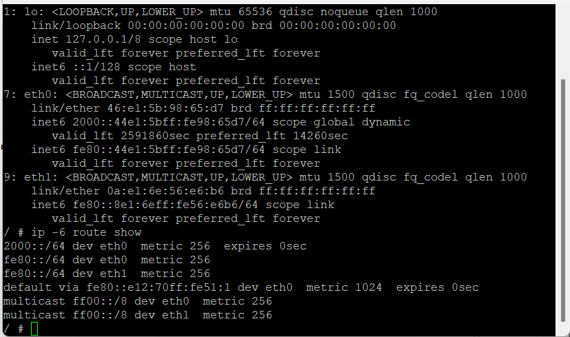{#fig:014 width=70%}

Пингуем маршрутизатор (рис. [-@fig:015]). Видим, что было отправлено 2 пакета и получено 2 пакета без потерь.

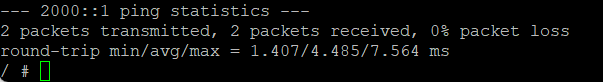{#fig:015 width=70%}

Попытка просмотра настроек DNS потерпели неудачу на обоих хостах alpine linux (рис. [-@fig:016]).

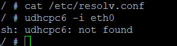{#fig:016 width=70%}

Я пытался исправить данную проблему, но никаким способом, которые я использовал, исправить это не получилось. Согласен, что я мог использовать неправильные методы исправления, но я, честно, старался это исправить.

# Выводы

В ходе данной лабораторной работы мной были получены навыки настройки службы DHCP на сетевом оборудовании для распределения адресов IPv4 и IPv6.

# Список литературы{.unnumbered}

[Сетевые технологии](https://esystem.rudn.ru/pluginfile.php/2858195/mod_resource/content/2/007-lab_ipv4-ipv6-dhcp-GNS3.pdf)
