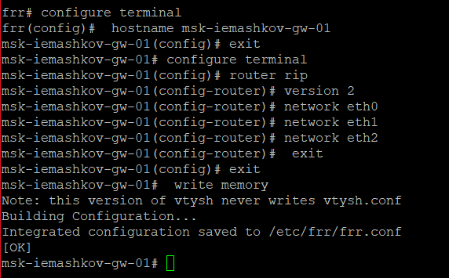
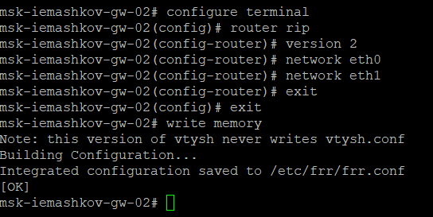
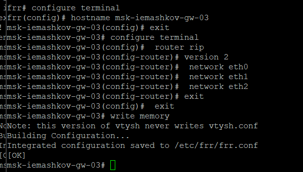
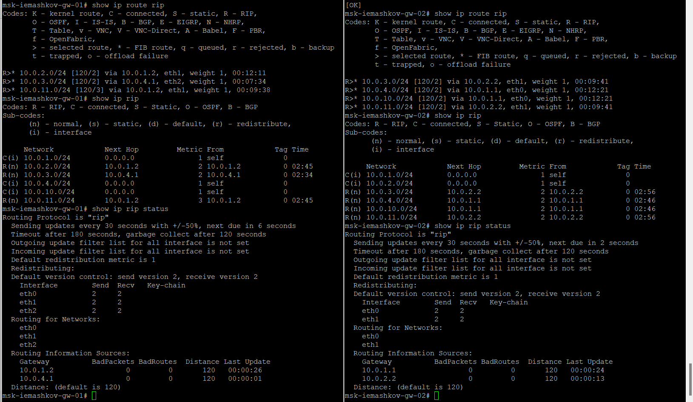
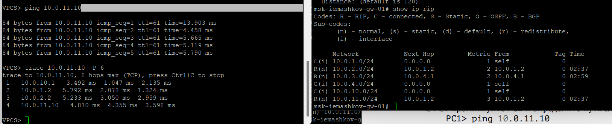
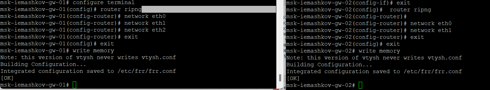
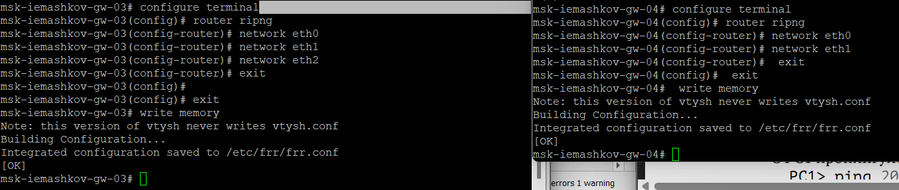
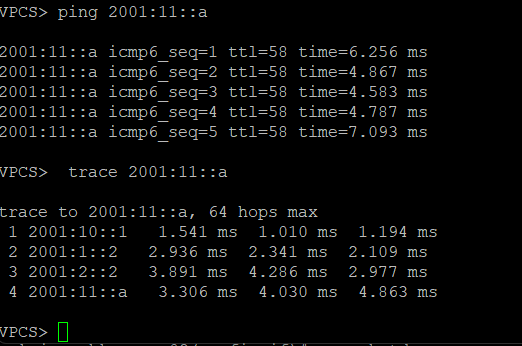
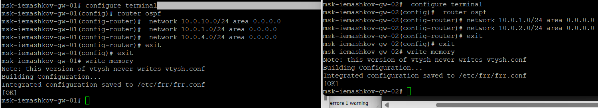

---
## Front matter
lang: ru-RU
title: Сетевые технологии
subtitle: Лабораторная работа №8
author:
  - Машков И. Е.
institute:
  - Российский университет дружбы народов, Москва, Россия

date: 15 февраля 2026

## i18n babel
babel-lang: russian
babel-otherlangs: english

## Formatting pdf
toc: false
toc-title: Содержание
slide_level: 2
aspectratio: 169
section-titles: true
theme: metropolis
header-includes:
 - \metroset{progressbar=frametitle,sectionpage=progressbar,numbering=fraction}
---

# Информация

## Докладчик

:::::::::::::: {.columns align=center}
::: {.column width="70%"}

  * Машков Илья Евгеньевич
  * Студент 3-го курса, группа НФИбд-02-23
  * Российский университет дружбы народов
  * [1132231984@pfur.ru](mailto:1132231984@pfur.ru)
  * <https://github.com/7S7eVe7N7>

:::
::: {.column width="30%"}

:::
::::::::::::::

## Цель работы

Цель данной работы — изучение принципов маршрутизации в IPv4- и IPv6-сетях и принципов настройки сетевого оборудования.

## Выполнение лабораторной работы

{width=70%}

## Выполнение лабораторной работы

{width=40%}

## Выполнение лабораторной работы

{width=40%}

## Выполнение лабораторной работы

{width=40%}

## Выполнение лабораторной работы

{width=40%}

## Выполнение лабораторной работы

{width=40%}

## Выполнение лабораторной работы

{width=50%}

## Выполнение лабораторной работы

{width=50%}

## Выполнение лабораторной работы

{width=50%}

## Выполнение лабораторной работы

{#fig:033 width=70%}

## Выполнение лабораторной работы

{width=50%}

## Выполнение лабораторной работы

{width=50%}

## Выводы

В ходе данной лабораторной работы мной были изучены принципы маршрутизации в IPv4- и IPv6-сетях и принципы настройки сетевого оборудования.
