---
## Front matter
title: "Лабораторная работа №8"
subtitle: "Сетевые технологии"
author: "Машков Илья Евгеньевич"

## Generic otions
lang: ru-RU
toc-title: "Содержание"

## Bibliography
bibliography: bib/cite.bib
csl: pandoc/csl/gost-r-7-0-5-2008-numeric.csl

## Pdf output format
toc: true # Table of contents
toc-depth: 2
lof: true # List of figures
lot: true # List of tables
fontsize: 12pt
linestretch: 1.5
papersize: a4
documentclass: scrreprt
## I18n polyglossia
polyglossia-lang:
  name: russian
  options:
	- spelling=modern
	- babelshorthands=true
polyglossia-otherlangs:
  name: english
## I18n babel
babel-lang: russian
babel-otherlangs: english
## Fonts
mainfont: PT Serif
romanfont: PT Serif
sansfont: PT Sans
monofont: PT Mono
mainfontoptions: Ligatures=TeX
romanfontoptions: Ligatures=TeX
sansfontoptions: Ligatures=TeX,Scale=MatchLowercase
monofontoptions: Scale=MatchLowercase,Scale=0.9
## Biblatex
biblatex: true
biblio-style: "gost-numeric"
biblatexoptions:
  - parentracker=true
  - backend=biber
  - hyperref=auto
  - language=auto
  - autolang=other*
  - citestyle=gost-numeric
## Pandoc-crossref LaTeX customization
figureTitle: "Рис."
tableTitle: "Таблица"
listingTitle: "Листинг"
lofTitle: "Список иллюстраций"
lotTitle: "Список таблиц"
lolTitle: "Листинги"
## Misc options
indent: true
header-includes:
  - \usepackage{indentfirst}
  - \usepackage{float} # keep figures where there are in the text
  - \floatplacement{figure}{H} # keep figures where there are in the text
---

# Цель работы

Цель данной работы — изучение принципов маршрутизации в IPv4- и IPv6-сетях и принципов настройки сетевого оборудования.

# Выполнение лабораторной работы

## Настройка динамической маршрутизации в сетях IPv4 и IPv6

Составляю топологию сети с двумя оконечными устройствами, комутаторами и 4-мя маршрутизаторами (рис. [-@fig:001]).

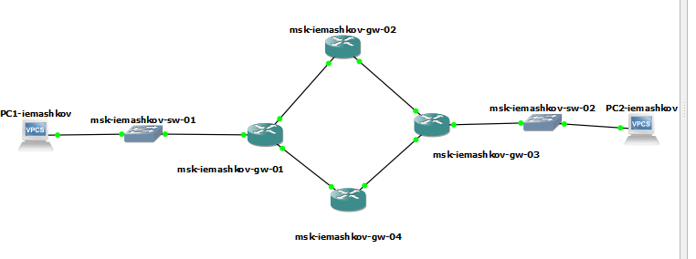{#fig:001 width=70%}

На ПК1 настраиваем адрес 10.0.10.10/24 (шлюз 10.0.10.1) (рис. [-@fig:002]), а на ПК2 10.0.11.10/24 (шлюз 10.0.11.1) (рис. [-@fig:003]).

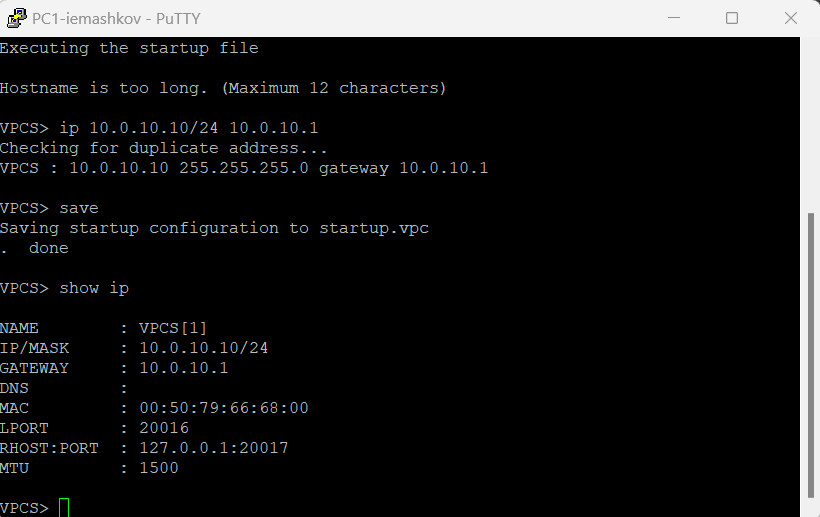{#fig:002 width=70%}

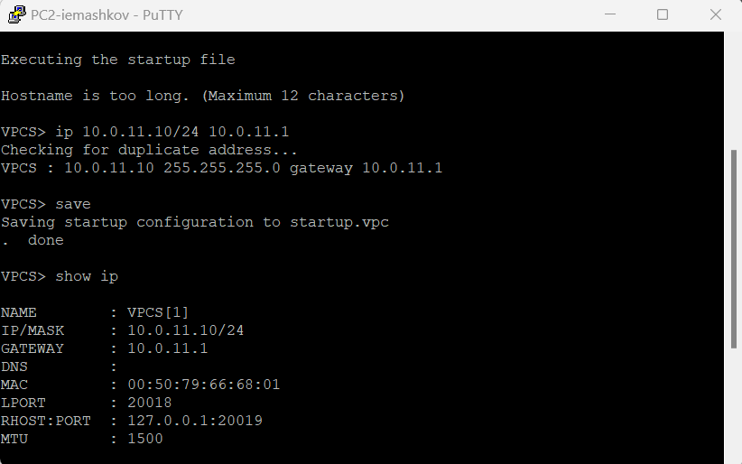{#fig:003 width=70%}

Затем настраиваем IPv4-адреса на интерфейсах маршрутизаторов, в соответствии с таблицей из файла лабораторной: gw-01 (рис. [-@fig:004]), gw-02 (рис. [-@fig:005]), gw-03 (рис. [-@fig:006]), gw-04 (рис. [-@fig:007]).

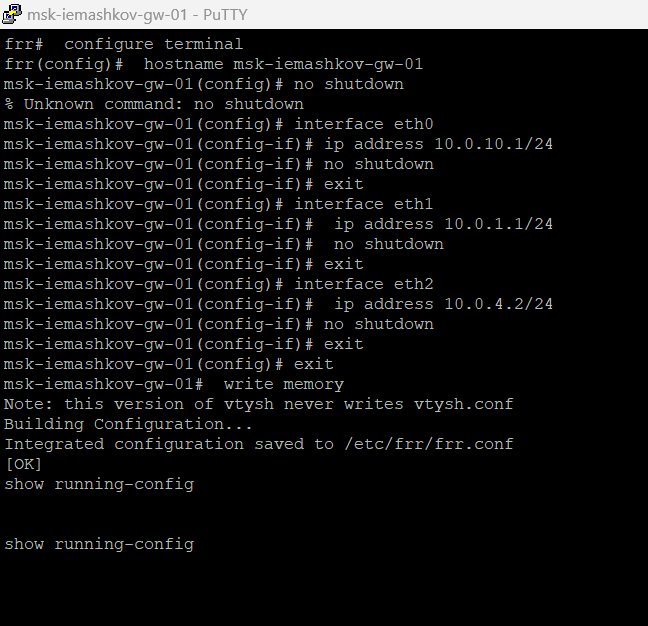{#fig:004 width=70%}

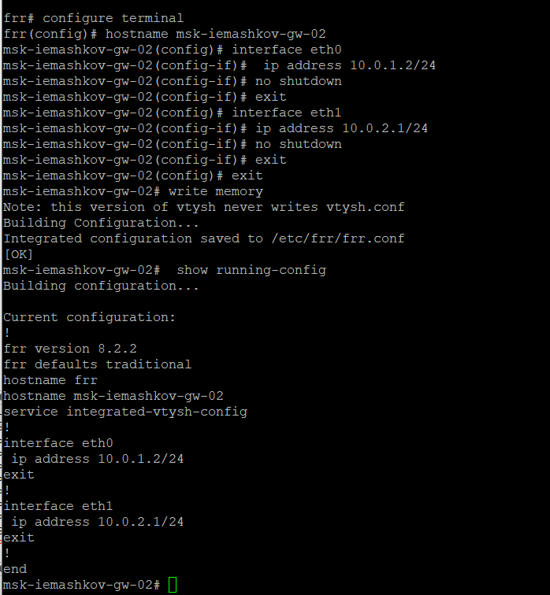{#fig:005 width=70%}

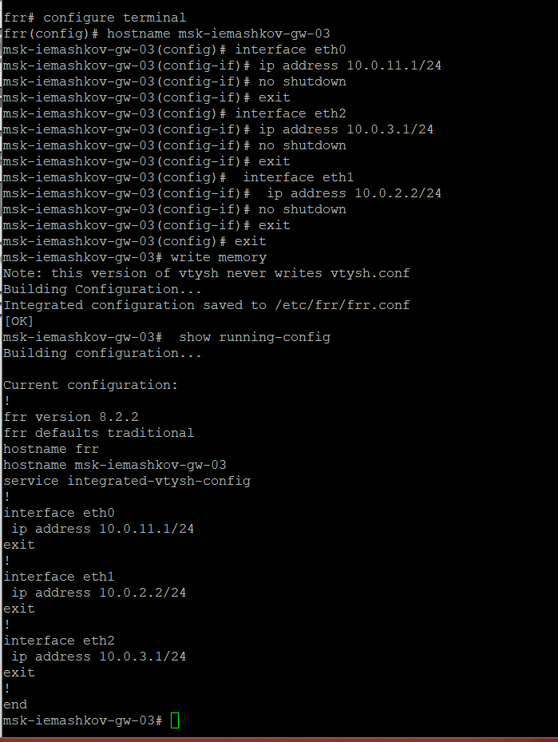{#fig:006 width=70%}

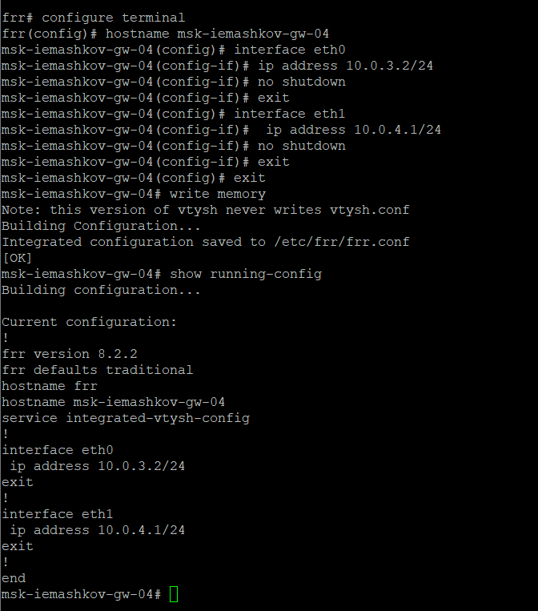{#fig:007 width=70%}

На ПК1 прописываем IPv6-адрес 2001:10::a/64 (рис. [-@fig:008]), а на ПК2 2001:11::a/64 (рис. [-@fig:009]).

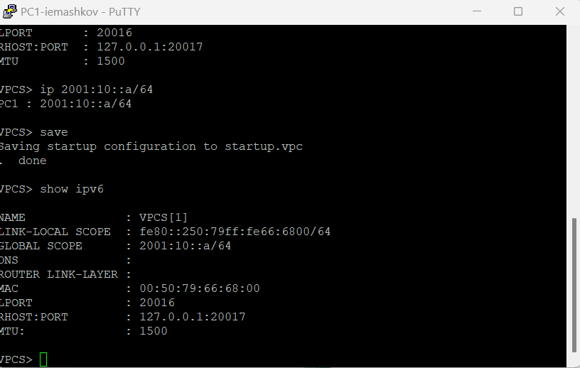{#fig:008 width=70%}

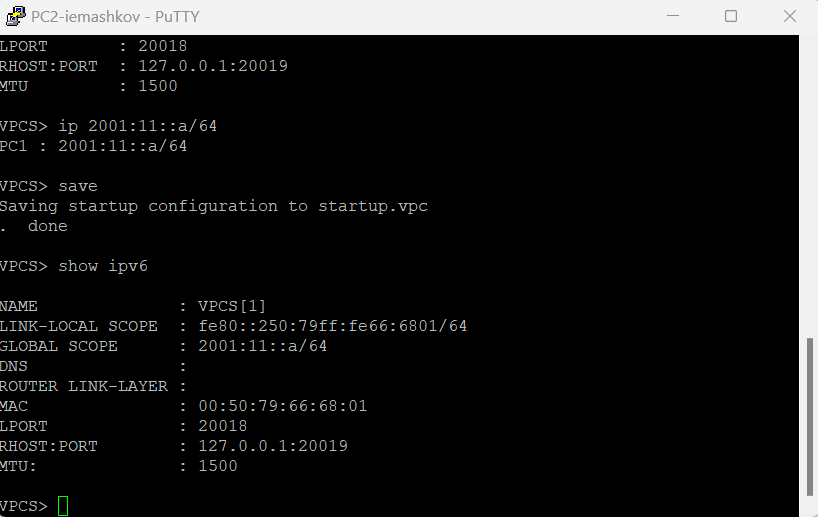{#fig:009 width=70%}

Затем настраиваем IPv6-адреса на интерфейсах маршрутизаторов, в соответствии с таблицей из файла лабораторной: gw-01 (рис. [-@fig:010]), gw-02 (рис. [-@fig:011]), gw-03 (рис. [-@fig:012]), gw-04 (рис. [-@fig:013]).

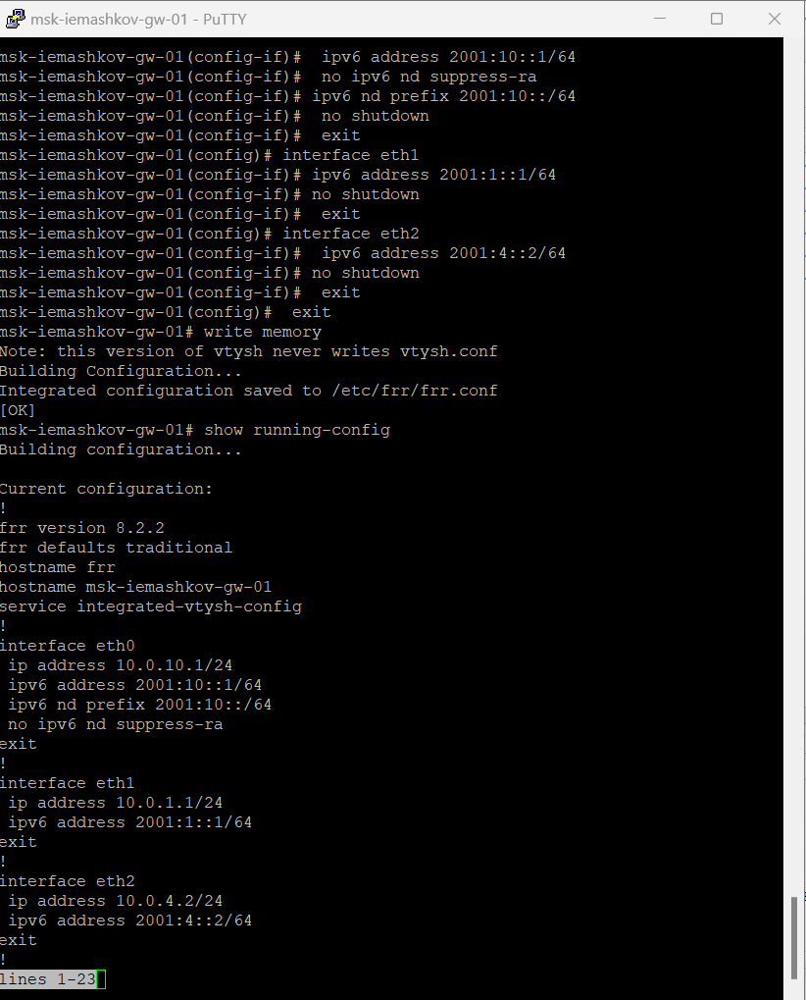{#fig:010 width=70%}

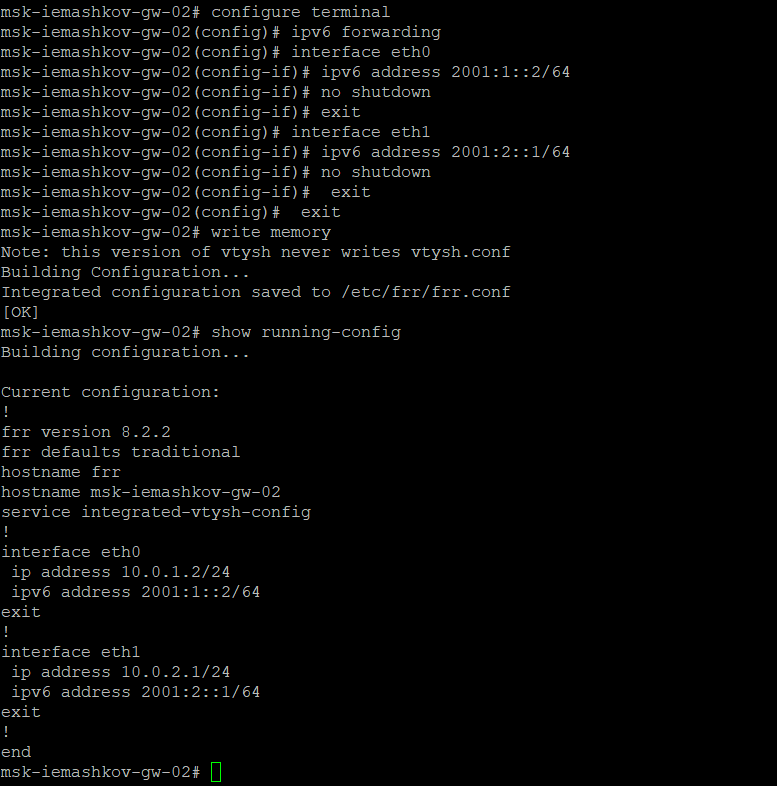{#fig:011 width=70%}

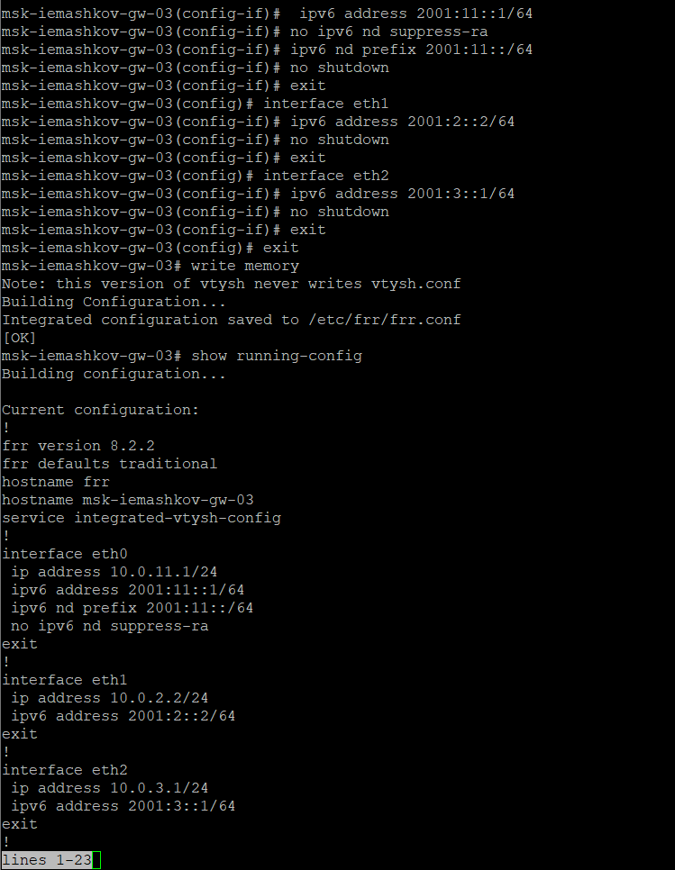{#fig:012 width=70%}

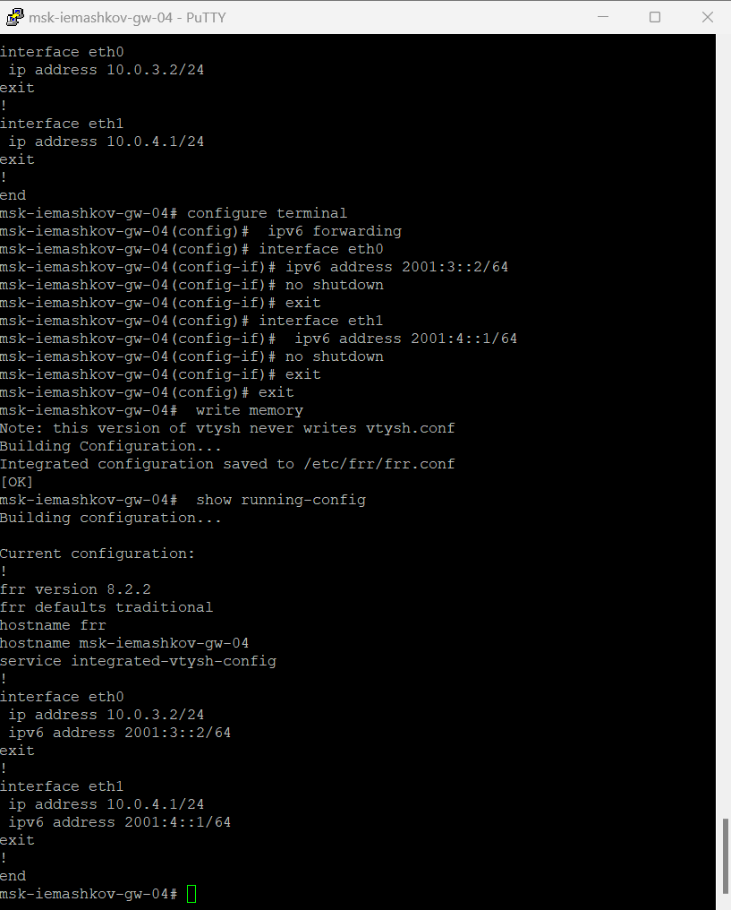{#fig:013 width=70%}

### Настройка динамической маршрутизации по протоколу RIP

Затем настроим динамическую маршрутизацию по протоколу RIP. В случае с IPv4 используется RIPv2, который использует многоадресную рассылку по адресу 224.0.0.9. Так вот, мы настраиваем RIP для всех интерфейсов наших роутеров: gw-01 (рис. [-@fig:014]), gw-02 (рис. [-@fig:015]), gw-03 (рис. [-@fig:016]), gw-04 (рис. [-@fig:017]).

{#fig:014 width=70%}

{#fig:015 width=70%}

{#fig:016 width=70%}

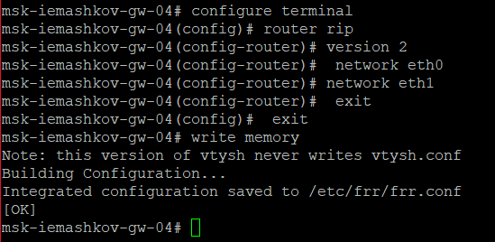{#fig:017 width=70%}

Убеждаемся, что маршрутизация по RIP настроена (рис. [-@fig:018]).

{#fig:018 width=70%}

Затем с ПК1 отпраляем эхо-запросы на ПК2 и прослеживаем путь следования пакето, а затем проверяем метрики протокола RIP (рис. [-@fig:019]).

{#fig:019 width=70%}

По информации из метрик мы видим, что пакеты идут через gw-02, поэтому мы отключим на этом маршрутизаторе интерфейс, к которому подключается gw-01 (рис. [-@fig:020]).

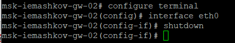{#fig:020 width=70%}

А затем проверяем метрики RIP (рис. [-@fig:021]). Видим, что пакеты прекратили идти на маршрутизатор gw-02.

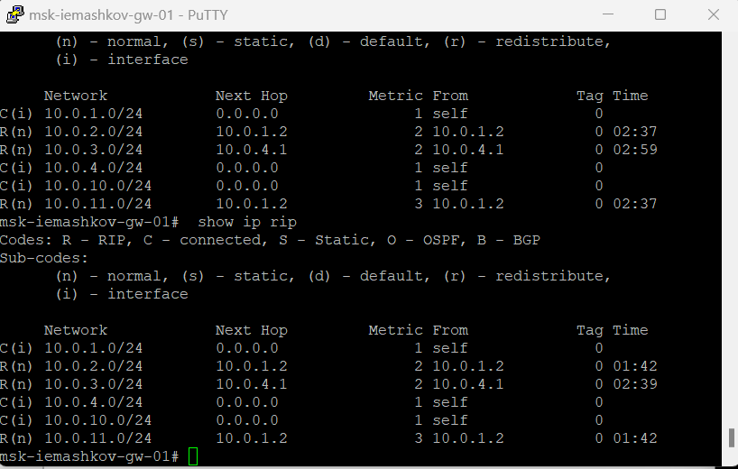{#fig:021 width=70%}

Пробуем пропинговать ПК2 с ПК1 и видим, что сделать этого не получилось, хотя пакеты должны были пройти через gw-03 (рис. [-@fig:022]).

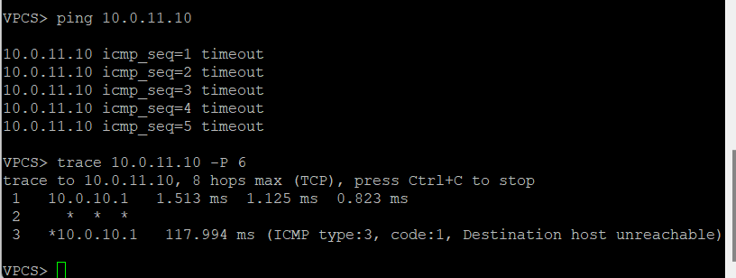{#fig:022 width=70%}

После включения интерфейса на gw-02 мы снова пингуем ПК2 и просматриваем захваченные пакеты (рис. [-@fig:023]). Видим, что с адреса ПК1 запросы приходят на RIP адрес.

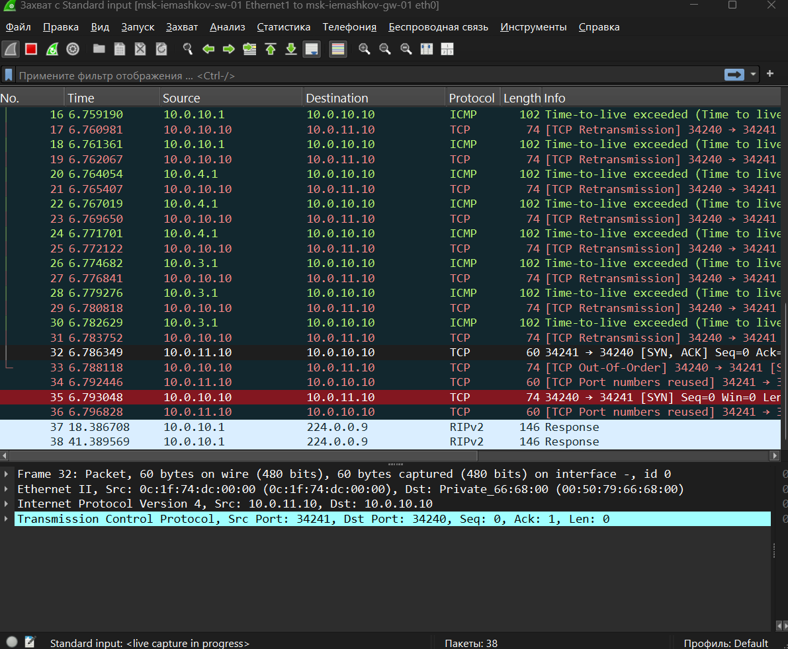{#fig:023 width=70%}

Теперь настраиваем RIPng для сетей IPv6 на gw-01 (рис. [-@fig:024]), gw-02 (рис. [-@fig:025]), gw-03 и gw-04 (рис. [-@fig:027]).

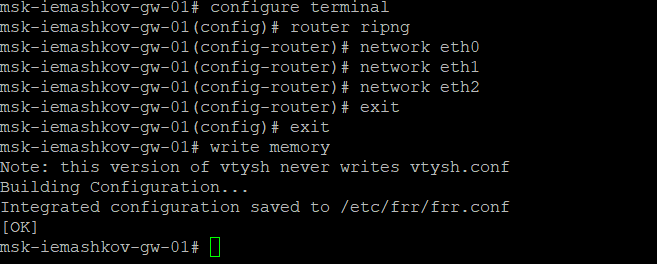{#fig:024 width=70%}

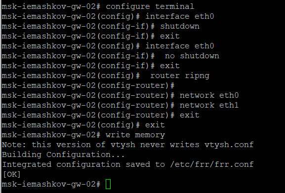{#fig:025 width=70%}

{#fig:027 width=70%}

После того, как я пропинговал с ПК1 узел ПК2, проверяем метрики протокола RIPng (рис. [-@fig:028]). Видим, что пакеты проходят через gw-02.

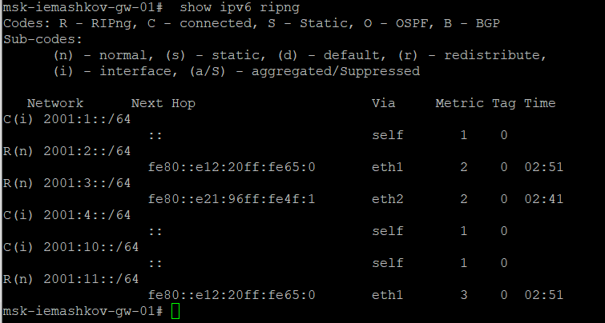{#fig:028 width=70%}

Мы выключаем интерфейс gw-02 (рис. [-@fig:029]).

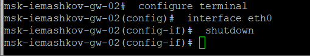{#fig:029 width=70%}

Затем снова пигуем ПК2 с ПК1 и опять видим, что пакеты не дошли до пк2 (рис. [-@fig:031]). Тут хотелось бы заметить, что через gw-04 была бы такая же ситуация.

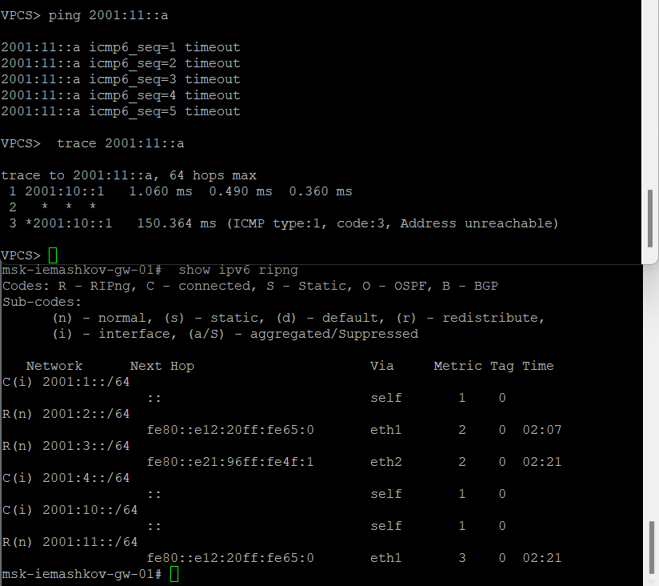{#fig:031 width=70%}

Включаем интерфейс на gw-02 (рис. [-@fig:032]).

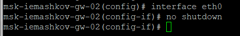{#fig:032 width=70%}

Пинг прошёл успешно (рис. [-@fig:033]).

{#fig:033 width=70%}

в WireShark просматриваем захваченные RIPng-пакеты (рис. [-@fig:034]). Видим, что запросы приходят на адрес характерный для RIPng - ff02::9

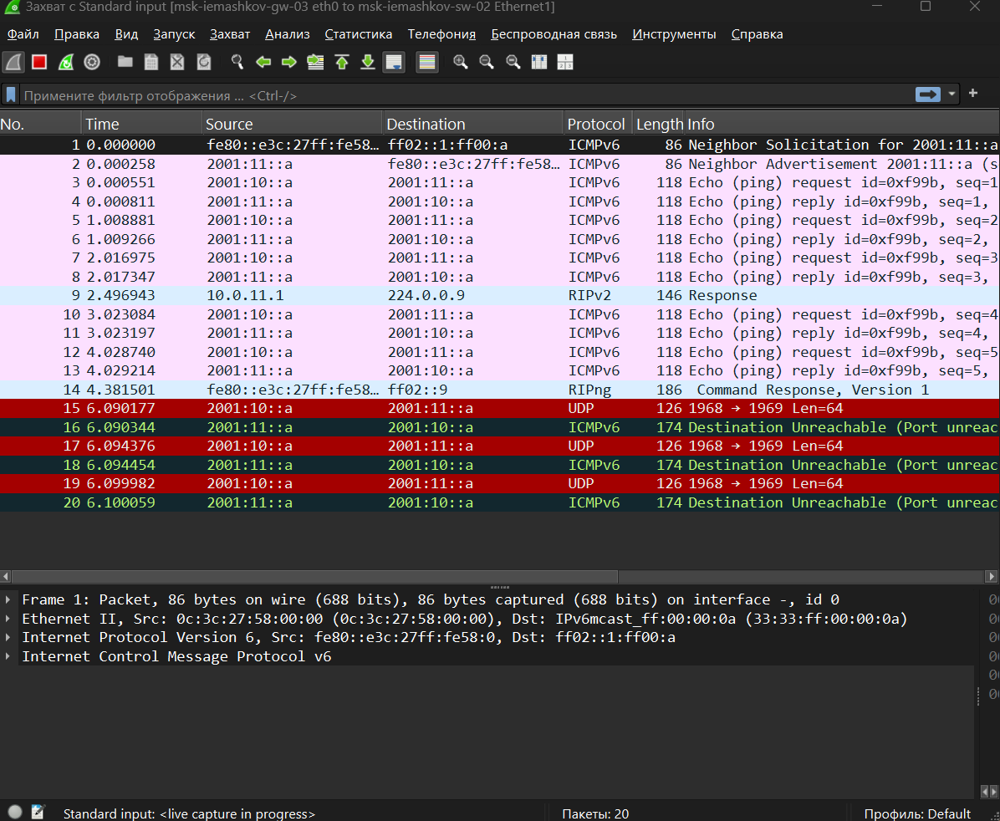{#fig:034 width=70%}

### Настройка динамической маршрутизации по протоколу OSPF

Займёмся же настройкой OSPRF на наших маршрутизаторах, благодаря которому можно просматриваь информацию о соседях osprf. Так вот, настраиваю OSPRFv2 для IPv4 на gw-01 и gw-02 (рис. [-@fig:035]), gw-03 и gw-04 (рис. [-@fig:036]).

{#fig:035 width=70%}

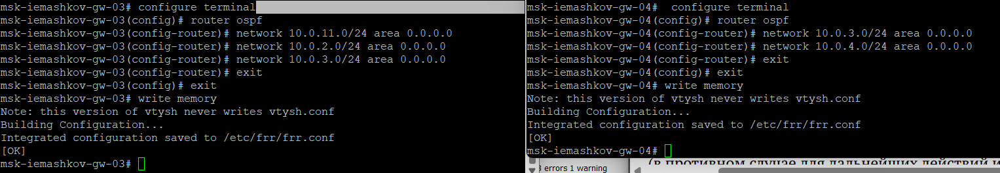{#fig:036 width=70%}

Отправляем эхо-запросы с ПК1 на ПК2 и видим, что всё отлично проходит (рис. [-@fig:037]).

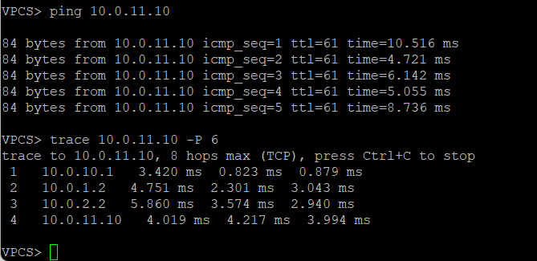{#fig:037 width=70%}

Затем проверяем таблицу маршрутизации osprf (рис. [-@fig:038]).

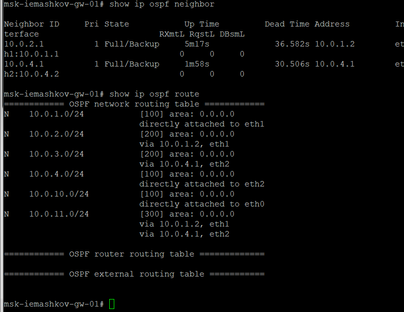{#fig:038 width=70%}

По данным из таблицы делаем предположение, что пакеты идут через gw-02, поэтому отключаем интерфейс этого маршрутизатора (рис. [-@fig:039]).

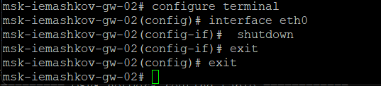{#fig:039 width=70%}

По таблице видим, что мы всё отключили (рис. [-@fig:040]).

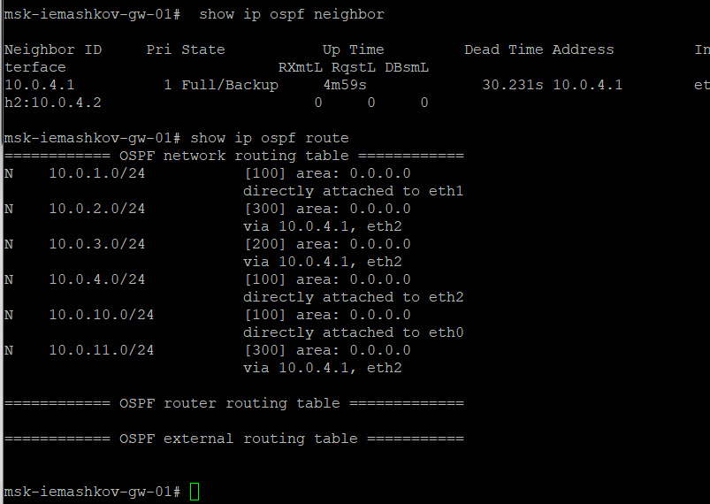{#fig:040 width=70%}

Пингуем ПК2 и видим, что в этот раз пинг спокойно проходит (рис. [-@fig:041]).

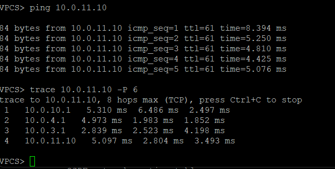{#fig:041 width=70%}

Теперь настраиваем OSPRFv3 для IPv6 на gw-01 и gw-02 (рис. [-@fig:042]), gw-03 и gw-04 (рис. [-@fig:043]).

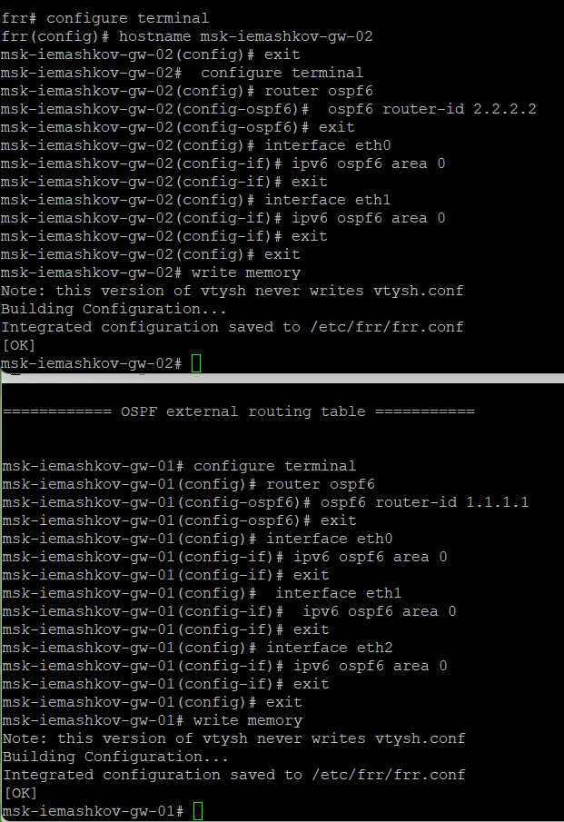{#fig:042 width=70%}

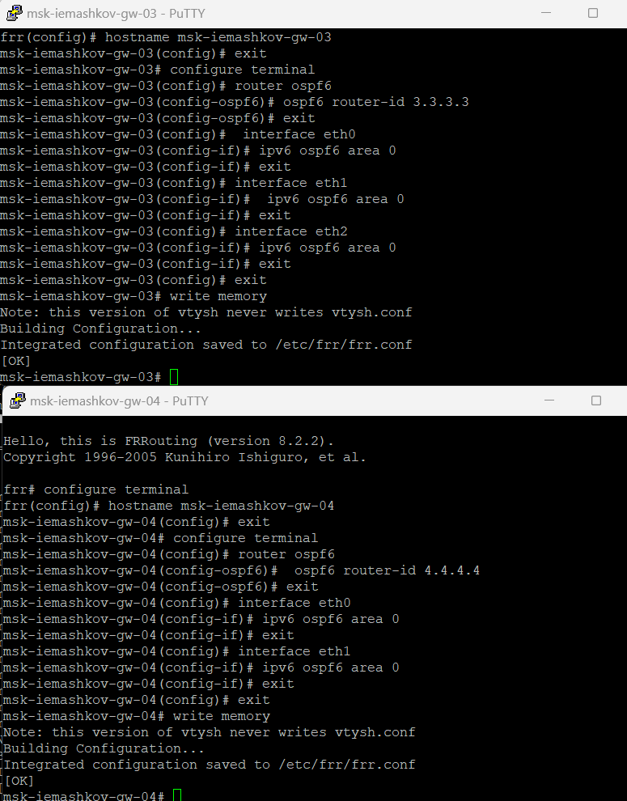{#fig:043 width=70%}

Отправляем эхо-запросы по ipv6 (рис. [-@fig:044]).

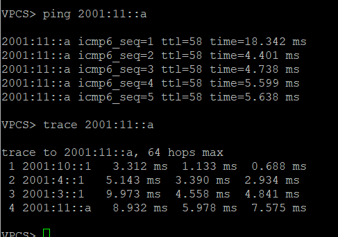{#fig:044 width=70%}

По таблице маршрутизации видим, что пакеты проходят и по gw-02, и по gw-04 (рис. [-@fig:045]).

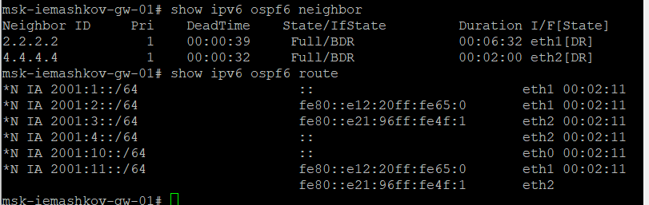{#fig:045 width=70%}

После отключения интерфейса на gw-02 мы видим, что маршрут постепенно восстановился (рис. [-@fig:046]).

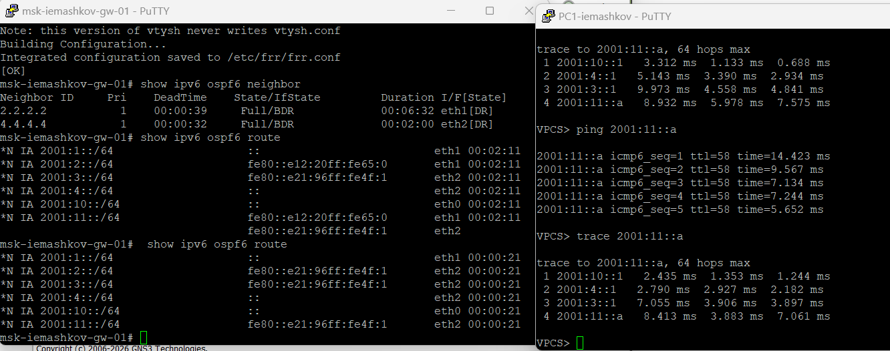{#fig:046 width=70%}

Возвращаем прежние настройки и видим, что пакеты дошли куда быстрее (рис. [-@fig:047]).

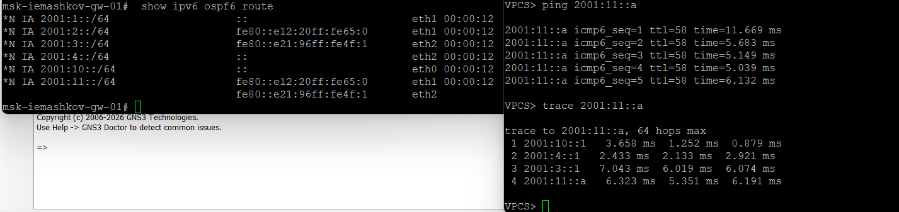{#fig:047 width=70%}

## Построение туннеля IPv6–IPv4

Строим топологию сети с двумя оконечными устройствами, в которой мы будем настраивать туннель IPv6-IPv4 (рис. [-@fig:048]).

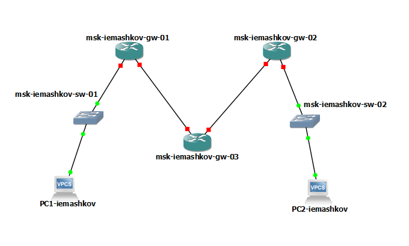{#fig:048 width=70%}

Выдаём IPv6 адреса на ПК1 и ПК2 (рис. [-@fig:049]).

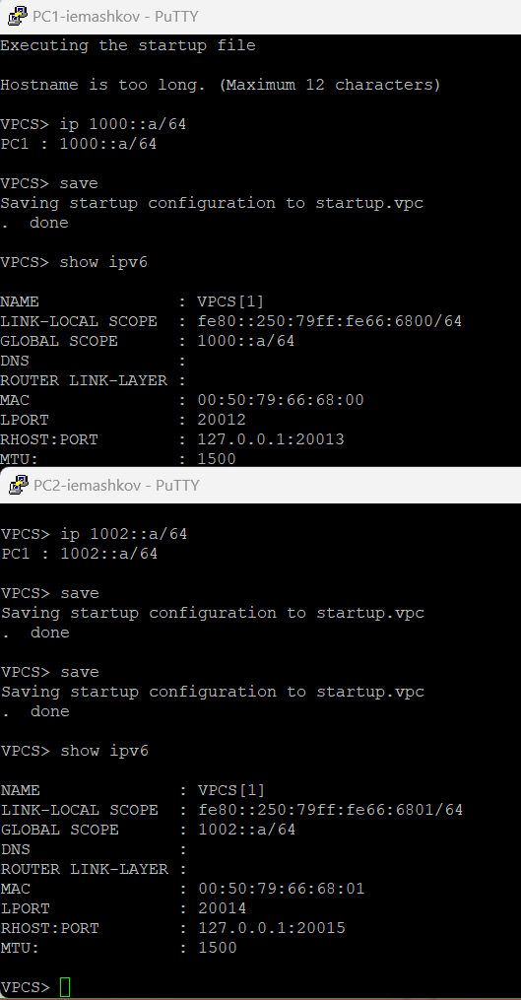{#fig:049 width=70%}

После настройки маршрутизаторов проверяем маршруты с gw-01 (рис. [-@fig:052]). Все маршруты работают отлично.

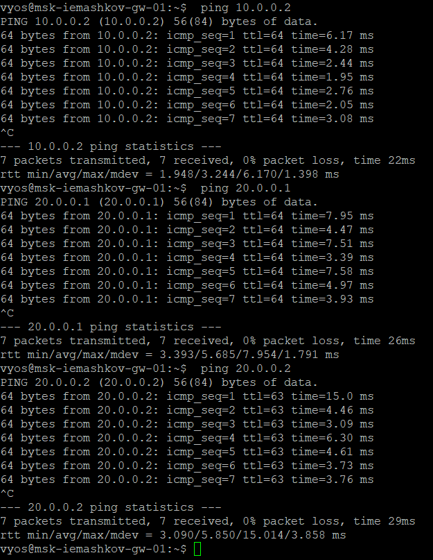{#fig:052 width=70%}

После настройки маршрутизации IPv4 и создания туннеля IPv6 через IPv4, я проверяю работу путём отправки обоюдных эхо-запросов с ПК1 и ПК2 (рис. [-@fig:053]).

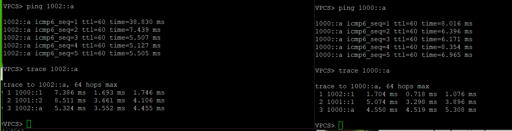{#fig:053 width=70%}

## Задание для самостоятельного выполнения

Таблица адресации выглядит так (рис. [-@fig:054]).

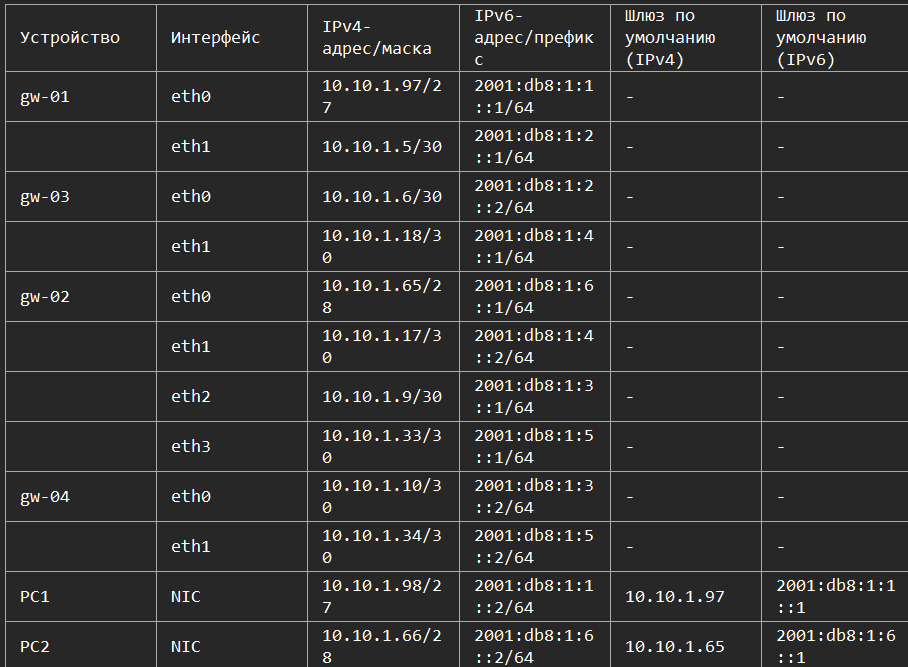{#fig:054 width=70%}

Топология данной сети похожа на ту, что была в самом начале лабораторной работы (рис. [-@fig:055]).

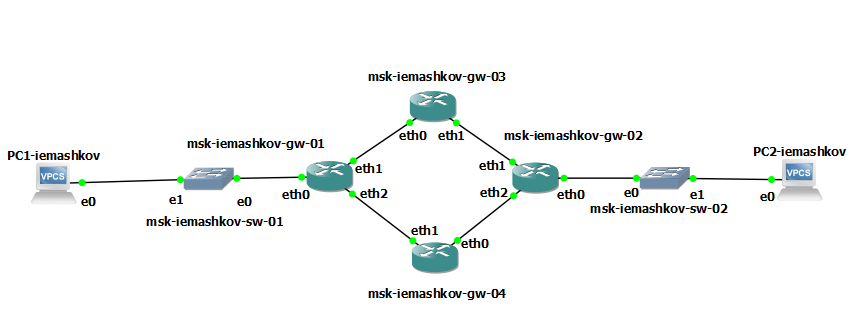{#fig:055 width=70%}

У меня возникли некоторого рода проблемы, из-за которых выполнить это задание я не смог. Как мы видим топология похожа на ту, что была в начале, но тут у нас маршрутизаторы на VyOS. Т.е. настройка будет точь в точь такой же, как и в самом начале ЛР, но с синтаксисом VyOS и немного другими адресами.

# Выводы

В ходе данной лабораторной работы мной были изучены принципы маршрутизации в IPv4- и IPv6-сетях и принципы настройки сетевого оборудования.

# Список литературы{.unnumbered}

[Сетевые технологии](https://esystem.rudn.ru/pluginfile.php/2858199/mod_resource/content/1/008-lab_routing-GNS3.pdf)
